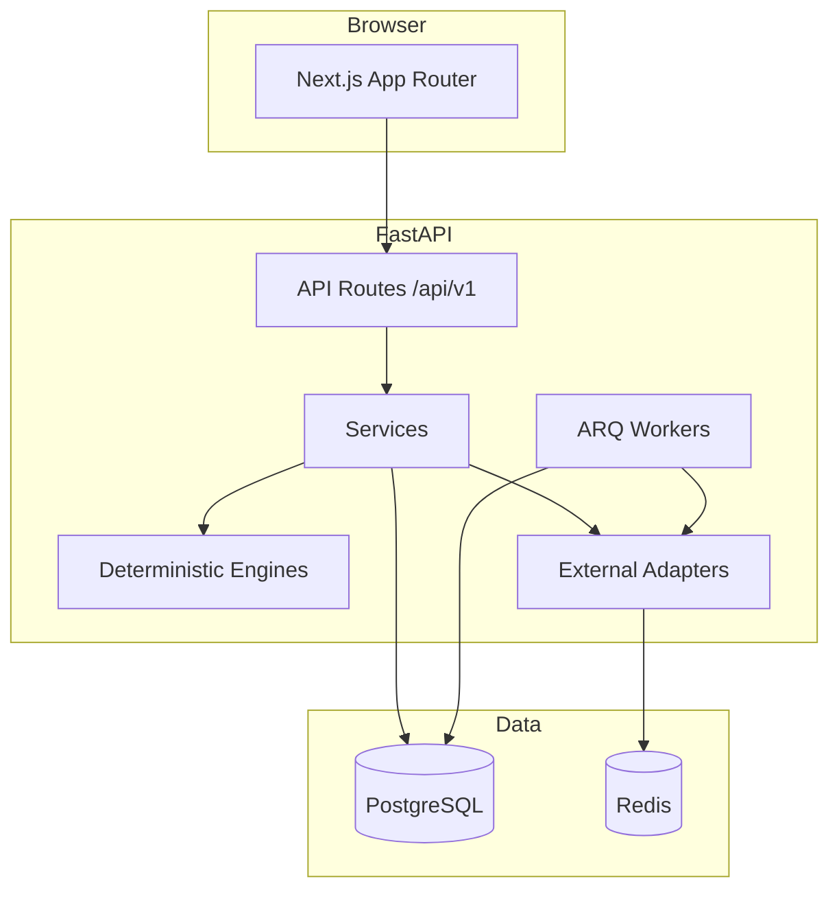
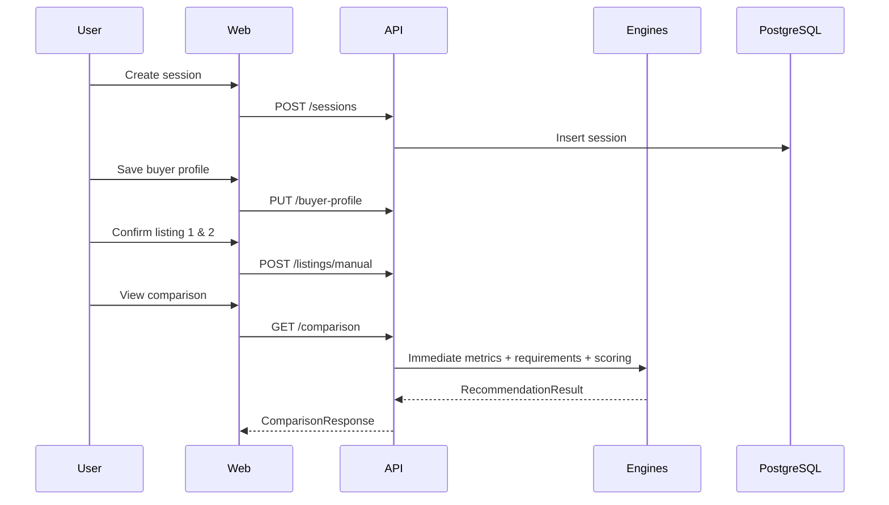

# NearHome Architecture

## Overview

NearHome is a monorepo decision-support application. Business rules live in the Python **domain** and **engines** layers; the Next.js frontend displays evidence and collects user input.



## Layer boundaries

| Layer | Responsibility |
| --- | --- |
| `domain/` | Enums, dataclasses, invariants |
| `engines/` | Requirements, scoring, recommendation (deterministic) |
| `services/` | Workflows orchestrating repositories and engines |
| `repositories/` | Database access |
| `adapters/` | OneMap, Google, LTA, MOE, HDB, LLM |
| `jobs/` | Enrichment orchestration |
| `schemas/` | Pydantic API contracts |

## Key architectural decisions

| Decision | Choice | Rationale |
| --- | --- | --- |
| ADR-001 | Ranked priorities with 45/35/20 weights | Spec allows ranked or equal; ranked gives clearer UX |
| ADR-002 | Sync SQLAlchemy sessions in Phase 1 | Simpler for learners; async optional later |
| ADR-003 | `DEMO_MODE` with mock adapters | Real interfaces, no fake-as-official data |
| ADR-004 | LLM never selects recommendation | Enforced in engine layer, not UI |
| ADR-005 | Immediate comparison has zero external deps | Spec rule: useful results appear early |

## End-to-end sequence (manual two-listing flow)



## Repository layout

```text
nearhomev2/
├── apps/api/          FastAPI backend
├── apps/web/          Next.js frontend
├── workers/           Worker entry (via apps/api/app/jobs)
├── data_pipeline/     HDB/MOE/LTA ingestion (Phase 2+)
├── apps/api/app/evaluation/  Deterministic fair-price challenger benchmarks
├── docs/              Product and engineering docs
├── tests/e2e/         Playwright flows (Phase 5)
└── scripts/           Local startup helpers
```

## Security

- Provider keys server-side only
- Rate limiting and request-size limits on Smart Paste (Phase 3)
- Session deletion endpoint removes associated data
- CORS restricted to configured origins

See [security-and-privacy.md](security-and-privacy.md).
