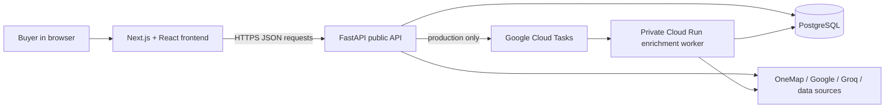
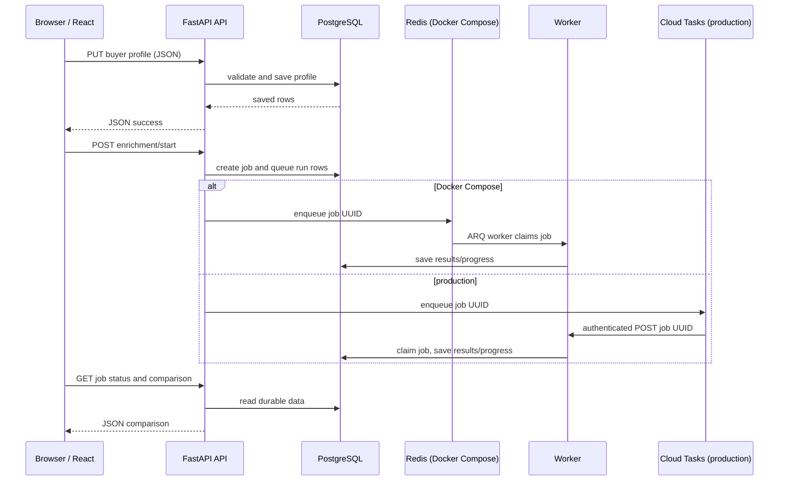
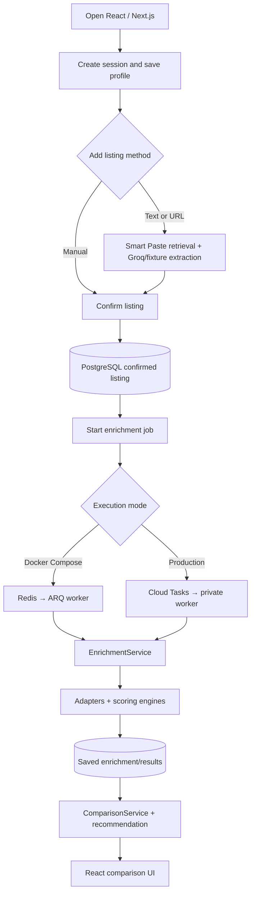

# NearHome — Tier 1 Technical Understanding

This is a beginner-friendly map of the current NearHome codebase. It explains the system as it is implemented today, not as a generic property-comparison application.

## How to use this document

Read it in order once, then return to the sections you find hardest. The goal is to explain each idea in your own words, not memorise every line of code. In an interview, being able to describe the path data takes through the system is more useful than naming every library.

When a term appears for the first time, this guide defines it and explains its NearHome role. File paths and function names are included so you can open the code after reading the explanation.

## 1. Overall Architecture

### The simple mental model

```text
User → Frontend → Backend API → Database / external services → Backend API → Frontend
```

The **frontend** is the part a person sees and clicks in their browser. NearHome's frontend is a **Next.js** application: Next.js is a framework for building web applications with React. **React** is a JavaScript library for building a page from reusable components and changing the screen when data changes.

The **backend** is server-side code: it runs away from the browser and can safely use database credentials and private API keys. NearHome's backend is written in Python with **FastAPI**, a framework for receiving web requests and returning web responses.

An **API** (application programming interface) is an agreed way for two programs to communicate. An API **endpoint** is one named address in that interface, such as `POST /api/v1/sessions`. A **request** is the message asking for work; a **response** is the message sent back. NearHome normally sends these messages over **HTTP**, the web's request/response protocol, using **JSON** (JavaScript Object Notation), a text format for structured data such as objects and lists.

The **database** is the durable store of information. NearHome uses PostgreSQL, a relational database: it stores information in related tables, for example sessions, confirmed listings, enrichment jobs, and results. The browser does not connect to PostgreSQL directly. Doing so would expose credentials and let an untrusted browser bypass NearHome's validation and business rules.

A **server** is a program that waits for network requests and performs work for other programs. Here, FastAPI is the public API server. A **route** is code attached to a URL/method combination; in FastAPI, routes become API endpoints. A **service** is a class/module that coordinates a multi-step business workflow, such as enrichment. A **repository** is a class that concentrates database reads/writes so other code does not need to know table-query details. A **database model** is a Python class describing how one database table and its columns/relationships are represented in code; NearHome's SQLAlchemy models are in `models/orm.py`.



Why split it this way? The frontend is good at forms, interactions, and presentation. The backend is trusted to validate input, coordinate providers, run models, and control database access. PostgreSQL keeps results when a tab closes. External providers are isolated behind adapters, so their formats and failures do not spread throughout the application.

### Actual components

| Layer | Current technology | NearHome responsibility |
| --- | --- | --- |
| Frontend | Next.js 15, React 19, TypeScript, Tailwind CSS | Buyer forms, listing-entry UI, comparison UI, progress display. TypeScript adds checks to JavaScript before running it. Tailwind supplies CSS utility classes for styling. |

| Browser data state | TanStack Query, React Hook Form, Zod | TanStack Query fetches/caches API data in the browser and manages loading/error states. React Hook Form manages form fields. Zod checks form shapes in the frontend. |

| Public backend | Python, FastAPI, Pydantic | Receives requests, validates bodies, reads/writes data, returns JSON. Pydantic is the Python validation library FastAPI uses for typed request/response schemas. |

| Persistence | PostgreSQL, SQLAlchemy, Alembic | SQLAlchemy is a Python **ORM** (object-relational mapper): it lets Python classes/functions represent database tables and queries. Alembic applies versioned database structure changes, called migrations. |

| Enrichment execution | Docker Compose: ARQ + Redis worker; production: Google Cloud Tasks + private Cloud Run worker | Enrichment gathers outside evidence and calculates longer-running results. Both configured queue modes persist a job and let the browser poll real stage progress. Inline execution still exists only as a local/test compatibility mode. |

| Models and scoring | Python engines, CatBoost, pandas | Deterministic engines calculate transport/driving/recommendation metrics. CatBoost supplies the primary fair-price prediction when its built artifact is usable. |

| External data | OneMap, Google Places/Routes, Groq, data.gov.sg/HDB, LTA fixtures | Geocoding, address selection, routes, Smart Paste extraction, carpark data, and curated transport data. Demo mode substitutes deterministic local fixtures/mocks. |

### NearHome code

| File / directory | What it does |
| --- | --- |
| `apps/web/src/app/` | Next.js pages: the landing page, session workspace, and comparison page. |
| `apps/web/src/lib/api.ts` | The frontend's central HTTP client and typed functions such as `saveBuyerProfile`, `smartPaste`, and `startEnrichment`. |
| `apps/web/src/components/` | Reusable UI pieces, including `EnrichmentProgress` and `ComparisonView`. |
| `apps/api/app/main.py` | Creates the public FastAPI application, CORS policy, request logging, and API router. |
| `apps/api/app/api/routes.py` | Defines actual HTTP endpoints and sends work to services/repositories. |
| `apps/api/app/services/` | Coordinates multi-step workflows such as enrichment, comparison, and Smart Paste. |
| `apps/api/app/engines/` | Pure calculation logic for fair price, public transport, driving, requirements, and recommendation. |
| `apps/api/app/adapters/` | The boundary around external APIs, fixtures, routing providers, and provider-specific errors. |
| `apps/api/app/repositories/` | The database boundary: classes that load and save application data. |
| `apps/api/app/models/orm.py` | SQLAlchemy table mappings, also called database models. |
| `apps/api/app/worker_main.py` | The private production worker endpoint that executes durable enrichment jobs. |
| `docker-compose.yml` | Local multi-container stack: PostgreSQL, Redis, API, ARQ worker, and web. |
| `docs/DEPLOYMENT.md` | The repository's intended Vercel + Cloud Run + Supabase production topology. |

### What I should be able to explain

1. What is the difference between NearHome's frontend, backend, and database?
2. Why does the browser send a request to FastAPI instead of connecting to PostgreSQL?
3. What does an endpoint such as `POST /api/v1/sessions` mean?
4. Why are external APIs accessed from backend code rather than ordinary browser code?

### Relevant NearHome files

- `apps/web/package.json`, `apps/api/pyproject.toml`
- `apps/api/app/main.py`, `apps/api/app/api/routes.py`, `apps/api/app/core/config.py`
- `apps/api/app/models/orm.py`, `apps/api/app/db/session.py`
- `docker-compose.yml`, `docs/DEPLOYMENT.md`

## 2. End-to-End Request Flow

This section traces a real central flow: saving a buyer profile, adding listings, starting enrichment, and displaying the comparison.

### HTTP methods in plain language

- **GET** asks to read information. Example: `GET /sessions/{id}/comparison`.
- **POST** asks to create something or start an action. Example: `POST /enrichment/start`.
- **PUT** replaces or updates a known resource. NearHome uses it to save a buyer profile.
- **DELETE** removes a resource. NearHome uses it for listings and unconfirmed Smart Paste drafts.

### 1. Saving a buyer profile

1. On the session page, React Hook Form holds the current form values. React state is temporary data kept in the browser while the page is open; it is not the durable record.
2. `saveProfile` in `apps/web/src/app/session/[sessionId]/page.tsx` is a TanStack Query mutation. A **mutation** is a browser-side operation that changes server data.
3. It calls `saveBuyerProfile()` in `apps/web/src/lib/api.ts`. That calls `apiFetch()`, which makes an HTTP `PUT` request to `/api/v1/sessions/{sessionId}/buyer-profile` with a JSON body.
4. FastAPI matches the request to `upsert_buyer_profile()` in `apps/api/app/api/routes.py`. Its `BuyerProfileInput` Pydantic schema validates the incoming fields. A **schema** is a definition of the expected fields/types/rules.
5. The route turns incoming priority and location data into domain objects, calls `RequirementEngine.validate_requirement()` for any hard requirements, then calls `SessionRepository.upsert_buyer_profile()`.
6. The repository uses a SQLAlchemy `Session`—a short-lived Python database conversation—to insert or update PostgreSQL rows for the profile, priorities, requirements, and locations.
7. The API returns JSON indicating the profile was saved. TanStack Query invalidates its cached `session` and `comparison` queries. Invalidating means “this browser copy may be old; fetch it again when needed.”

### 2. Adding listings and getting an immediate comparison

`addListing` calls `addManualListing()` in `apps/web/src/lib/api.ts`, which sends `POST /sessions/{id}/listings/manual`. `create_manual_listing()` checks that the session exists and rejects duplicate address/asking-price pairs. `SessionRepository.confirm_listing()` saves a confirmed listing in PostgreSQL.

The comparison page calls `getComparison()` with `GET /sessions/{id}/comparison`. `ComparisonService.get_comparison()` loads the profile/listings and calls `ImmediateComparisonEngine.compute()`. That immediate step calculates facts such as price per sqm and budget difference without waiting for external services. It also calls the preference and recommendation engines using whatever enriched data is currently available.

### 3. Starting enrichment and showing results

1. The comparison page's `enrich` mutation calls `startEnrichment()` in `apps/web/src/lib/api.ts`.
2. FastAPI handles `POST /sessions/{id}/enrichment/start` in `start_enrichment()`.
3. It creates or reuses an active durable `enrichment_jobs` row and marks prior enrichment runs as queued.
4. In Docker Compose, `JOB_EXECUTION_MODE=arq`: the API puts the durable job on Redis and returns its job ID immediately. The separate `app.jobs.worker` process claims it and calls `EnrichmentService.run_session_enrichment()`, saving each stage as it proceeds. In production `cloud_tasks` mode, the public API instead enqueues the job with Cloud Tasks and returns HTTP 202 Accepted rather than doing provider work itself.
5. In production, Cloud Tasks calls `run_enrichment_task()` in `apps/api/app/worker_main.py`. The private worker atomically claims the job, runs `EnrichmentService`, saves progress/results, and returns an HTTP result to Cloud Tasks.
6. `EnrichmentProgress` in `apps/web/src/components/enrichment-progress.tsx` polls `getEnrichmentJob()` and `getEnrichmentStatus()` with a gradually increasing delay. Polling means repeatedly asking for the latest saved job state.
7. On a terminal job status, the React page refetches the session/comparison query. `ComparisonView` receives the new JSON and renders it.



### Why persist instead of only storing results in the frontend?

Browser state disappears on refresh, is specific to one device/tab, and is not safe for long work. PostgreSQL gives the session a durable identity, preserves listings and job progress, makes background work possible, and lets the browser reconnect and poll for results.

### In one sentence

“NearHome's React frontend sends JSON requests to a FastAPI backend, which validates and persists buyer data in PostgreSQL, runs or queues enrichment, and returns saved comparison results for the frontend to display.”

### Relevant NearHome files

- `apps/web/src/app/session/[sessionId]/page.tsx` — `saveProfile`, `addListing`, `pasteExtract`, `confirmFromPaste`
- `apps/web/src/app/session/[sessionId]/comparison/page.tsx` — `enrich`, query refresh flow
- `apps/web/src/lib/api.ts` — `apiFetch`, `saveBuyerProfile`, `startEnrichment`, `getComparison`
- `apps/api/app/api/routes.py` — `upsert_buyer_profile`, `create_manual_listing`, `start_enrichment`
- `apps/api/app/services/comparison_service.py` — `ComparisonService.get_comparison`
- `apps/api/app/repositories/session_repository.py`, `apps/api/app/models/orm.py`

## 3. Enrichment Pipeline

**Enrichment** means adding evidence and calculated results to a confirmed basic listing. A basic listing has user-confirmed information such as address, asking price, floor area, flat type, and sometimes lease. An enriched listing may additionally have coordinates, fair-price evidence, public-transport results, driving results, schools, and journey estimates.

It is not the same as Smart Paste. Smart Paste extracts possible listing fields before user confirmation. Enrichment analyses a confirmed listing afterwards.

### What triggers it and where it runs

The frontend calls `POST /api/v1/sessions/{session_id}/enrichment/start`. The route is `start_enrichment()`.

A **queue** is a durable waiting line of work. A **worker** is a separate process that takes queued work and performs it outside the public request path. NearHome records the job in PostgreSQL; in production Google Cloud Tasks delivers that job to the private worker.

- **Local Docker Compose:** `JOB_EXECUTION_MODE=arq` and `REDIS_URL` are set for both API and worker. The API enqueues the durable job and returns promptly; the ARQ worker performs enrichment while `EnrichmentProgress` polls its saved stage/status. This is the default local stack, so the progress page can show real work rather than wait for one inline request to finish.
- **Production:** `Settings.validate_production()` requires `JOB_EXECUTION_MODE=cloud_tasks`. The public API stores a job and returns 202. Google Cloud Tasks later invokes private `worker_app` in `worker_main.py`.
- **Other local/test mode:** `inline` is still implemented for simple local/test execution. It claims and completes the job within the API request, so it cannot provide incremental worker progress in the same way. ARQ is a Python worker library backed by Redis; it is a local queue implementation, not the intended Cloud Run production architecture.

### Main orchestration

`EnrichmentService.run_session_enrichment()` creates a routing provider and then calls `_run_session_enrichment()`. It loops through listings and calls `_enrich_listing()`. The listing loop is sequential, so one listing's stages are completed before the next listing is processed. Some independent route calls inside a stage use `run_bounded_route_calls()`, which provides limited concurrency rather than making unlimited simultaneous provider calls.

| Stage | File | Function/class | Purpose |
| --- | --- | --- | --- |
| Plan work | `services/enrichment_service.py` | `plan_enrichments()` | Selects required work from the buyer profile: base data plus transport/driving/schools/journeys only when requested. |
| Geocode | same | `_enrich_listing()` with `get_geocoding_adapter()` | Turns an address into latitude/longitude. |
| Property/lease | same + `services/lease_estimation.py` | `estimate_remaining_lease()` | Resolves property attributes and lease evidence, recording source/confidence. |
| Transactions/fair price | same + `engines/fair_price.py` | `FairPriceEngine.estimate()` | Gets HDB transactions and computes CatBoost or weighted-comparable valuation. |
| Public transport | `engines/public_transport/engine.py` | `compute_public_transport_model()` | Produces a component rollup when public transport matters. |
| Driving | `engines/driving/engine.py` | `compute_driving_model()` | Produces a driving-connectivity rollup when driving matters. |
| Schools | `engines/schools.py` | `SchoolsEngine` | Finds nearby/selected school evidence when requested. |
| Personal journeys | `services/enrichment_service.py` | `_enrich_important_location_journeys()` | Calls a route matrix for complete saved important locations. |
| Persistence | `repositories/enrichment_repository.py` | `save_enriched_field`, `save_journey_estimate`, `upsert_run` | Saves field payloads, journey results, and stage statuses. |

In live mode, `adapters/live/onemap.py → LiveOneMapAdapter.geocode()` does not blindly accept the first OneMap search result. It takes the first result that has parseable coordinates inside a broad Singapore latitude/longitude envelope and, when both sides can be parsed as an HDB block/street address, does not conflict with the listing's canonical HDB block/street key. Missing provider address parts are allowed, because valid OneMap rows may omit them; a conflicting parsed block/street is rejected. This is a defensive address-quality check, not a claim that OneMap itself performs the business matching.

### Example listing

```text
Basic listing
  “123 Bishan St 12, S$700,000, 90 sqm, 4 ROOM”

After enrichment, conceptually
  + coordinates from a geocoding adapter
  + remaining-lease evidence
  + fair-price estimate/range and comparable transactions
  + public-transport component results
  + driving component results and carpark evidence
  + schools and chosen-location journey times when requested
```

The exact numbers depend on actual provider/fixture data; the code does not promise any particular result for that example.

### Failure handling, reuse, and caching

NearHome saves status per enrichment type. Many provider failures are recorded as unavailable/failed for that specific stage rather than making the whole comparison unusable. For an important-location route-matrix failure, the code saves an unavailable journey for each listing and continues. The worker treats timeouts, transport failures, and selected `AdapterError` categories as retryable, subject to the configured maximum attempts.

The code includes an optional route cache in `adapters/routing/cache.py`. A **cache** is a temporary saved answer used to avoid repeating expensive work. Route cache keys normalize coordinates, travel mode, and a time bucket, because time-sensitive routes should not blindly reuse a stale answer. Redis can back this cache if `REDIS_URL` is configured. The production deployment documentation intentionally omits Redis in Cloud Tasks mode, so a production Redis cache is not confirmed by this repository configuration.

Saved enrichment fields are durable in PostgreSQL and can be displayed on later comparison reads. Starting a new job marks existing runs queued so the UI does not show them as freshly completed; the current service code re-runs its enrichment stages rather than exposing a general “skip because field already exists” mechanism.

### Design decisions / limitations visible in the code

- The public production API does not perform long provider work inline; this reduces browser timeout risk and enables retries.
- Provider work is bounded: routing batches are limited, Playwright has timeout/concurrency settings, and the worker has conservative Cloud Run concurrency.
- Demo mode intentionally returns mock/fixture data and labels it rather than pretending it is official evidence.
- Transport thresholds are documented configuration values, not calibrated Singapore-wide percentiles (`transport_config.py`).
- Carpark availability becomes more useful only after enough historical snapshots have been collected; missing availability is not treated as zero availability.

### Relevant NearHome files

- `apps/api/app/api/routes.py` — `start_enrichment`, status/job endpoints
- `apps/api/app/services/enrichment_service.py` — `EnrichmentService`
- `apps/api/app/worker_main.py` — `run_enrichment_task`, retry logic
- `apps/api/app/repositories/enrichment_job_repository.py`, `enrichment_repository.py`
- `apps/api/app/adapters/routing/cache.py`, `batch.py`, `factory.py`
- `apps/api/app/core/config.py`, `docs/DEPLOYMENT.md`

## 4. Fair-Price Model

### Fair Price in concrete detail

#### Level 1 — what question it answers

The model asks: **given past HDB resale transactions, what price is plausible for this particular flat as of today?** It produces a central estimate, a range, an asking-price comparison, and a short list of human-readable comparable sales. It is not an official valuation and it does not know facts that are absent from its features, such as renovation quality, a particular unit's view, or a seller's urgency.

#### Level 2 — the actual data flow

```text
TRAINING (offline / image build)
fixture HDB transactions
  → clean rows and create features
  → CatBoostRegressor fit on historic prices ( training )
  → temporal residual calibration (After training, examine how wrong the model tends to be on later transactions and use those errors to construct a more realistic uncertainty/range. e.g. if model is normally 30k +/-, then range differs by predicted +/- 30k )
  → model.cbm + metadata.json artifact

INFERENCE (one enriched listing)
confirmed listing + geocoded town + lease estimate
  → same feature preparation
  → load and validate existing artifact
  → CatBoost price prediction + stored residual range
  → independently select weighted comparable evidence
  → CatBoost result, comparable fallback, or insufficient evidence
```

`apps/api/app/services/enrichment_service.py → EnrichmentService._enrich_listing()` loads transaction records, geocodes the address/town, resolves lease data, resolves explicit HDB flat-code evidence before any historical fallback, and calls `FairPriceEngine.estimate()`.

#### Flat code, flat type, and flat model are separate

`apps/api/app/services/smart_paste/flat_attributes.py → FLAT_CODE_ATTRIBUTES` is the one explicit allowlist used for compact listing codes. It preserves the raw code as `listing_flat_subtype`/`raw_listing_subtype`, derives the broad `flat_type`, and derives the CatBoost-compatible HDB `flat_model`. For example:

```text
raw listing evidence: 4I
listing_flat_subtype: 4I
flat_type: 4 ROOM
flat_model: Improved
```

It intentionally uses an allowlist rather than a suffix rule: `3S` and `4S` map to `Simplified`, while `5S` maps to `Standard`. Recognised values include Standard (`1STD`–`5STD`, `5S`), Improved (`1I`–`5I`), New Generation (`3NG`, `4NG`), Simplified (`3S`, `4S`), Model A (`2A`–`5A`), Model A2 (`4A2`), Premium Apartment (`3PA`–`5PA`), `EA`/`EM`, and `MG`. Existing safe portal aliases include formatting variants such as `4-i`, `4 I`, `4I (Improved)`, and `3NG (Modified)`; deterministic full names such as `4-room Improved` and `Executive Maisonette` are also accepted. `Jumbo`, unknown codes, and generic `4 ROOM`/`EXECUTIVE` remain unknown models.

The enrichment precedence is:

```text
existing explicit flat_model
  → recognised explicit subtype/code
  → historical same-address + same-flat-type inference
  → unknown (None)
```

Historical inference is fallback only. It now requires at least **5** matching transactions and a dominant model share of at least **90%**. It never guesses from broad room count, area, town, or a globally common model. This means an explicit `4I → Improved` beats five historical rows that happen to say `New Generation`. The mapping output strings (`Improved`, `New Generation`, `Model A`, `Model A2`, `Premium Apartment`, `Standard`, `Simplified`, `Apartment`, `Maisonette`, and `Multi Generation`) were checked against the transaction fixture's `flat_model` categories used in CatBoost training.

**Confirmed from current code:** `get_transactions_adapter()` in `apps/api/app/adapters/factory.py` always returns `FixtureHDBTransactionsAdapter`, which reads `data_pipeline/fixtures/hdb_transactions.json`. The fair-price transaction source is therefore currently repository-managed fixture data, not a live HDB transaction API. The document's wording “unless refreshed” means a repository/deployment refresh, not automatic runtime retrieval.

#### Training versus inference

Training changes the model. Inference only uses it.

| Phase | Current implementation | When it happens |
| --- | --- | --- |
| Training | `fair_price_catboost.py → train_artifact()` converts historical rows, calls `_fit()`, writes `model.cbm` and `metadata.json`. | Explicit CLI command, or the API Docker image build. |
| Image artifact creation | `apps/api/Dockerfile` runs `python -m app.engines.fair_price_catboost train --artifact-dir /app/model-artifacts/fair-price` and sets `FAIR_PRICE_MODEL_ARTIFACT_PATH` to that directory. | Docker build time. |
| Inference | `fair_price_catboost.py → predict()` filters history before the valuation month, calls `load_artifact()`, prepares one listing row, then calls `model.predict()`. | During listing enrichment. |

Inference never calls `fit()`. `test_fair_price_artifact.py` verifies that missing, incomplete, invalid, or incompatible artifacts return `None` rather than retraining. `FairPriceEngine.estimate()` then uses weighted comparables if possible. The loaded artifact is cached in memory by directory path after its first successful load.

An artifact is accepted only if its model version, transaction-snapshot SHA-256 key, and exact feature-column list match the current historical input. This prevents silently using a model trained on a different snapshot or feature layout.

#### CatBoost features — exact current inputs

`apps/api/app/evaluation/data.py → NUMERIC_FEATURES` and `CATEGORICAL_FEATURES` define the shared training/inference schema. `resale_price` is the target, never an input.

| Feature | Type | Listing / transaction source and transformation | Missing treatment |
| --- | --- | --- |
| `town` | categorical | Geocoder town if available; otherwise an exact historical-address town match may supply it. Normalised upper-case. | `__MISSING__`; inference declines CatBoost only when a provided town is absent from the history. |
| `flat_type` | categorical | Confirmed listing flat type, normalised by stripping an `HDB` suffix and parenthesised suffix; transaction values are upper-cased similarly. | Missing/unsupported flat type makes CatBoost return `None`. |
| `flat_model` | categorical | Explicit recognised HDB listing code/name first; only otherwise a ≥5-row, ≥90%-agreement same-address/same-flat-type transaction fallback; transaction field in training. | `__MISSING__`. |
| `floor_area_sqm` | numeric | Confirmed listing floor area; transaction field. | Training invalidates non-positive rows. At prediction, non-finite/missing values use the artifact's training median, then `0.0` only if that median is absent. |
| `storey_midpoint` | numeric | Mean of the numbers in `storey_range`, e.g. `10 TO 12` becomes 11. | Training/listing non-parsable values become missing and use the stored numeric median then `0.0`. |
| `lease_commencement` | numeric | Listing `lease_commencement_year`; transaction field. | Same median-then-zero preparation. |
| `remaining_lease_months_at_transaction` | numeric | Listing remaining lease in months at valuation; transactions compute `((lease_commencement + 99) × 12) − transaction_month_index`, floored at zero. | Fair-price engine requires a positive remaining lease before any valuation; otherwise median-then-zero preparation is only a defensive transform. |
| `transaction_month_index` | numeric | `year × 12 + month`; at inference it is the valuation month. | Same median-then-zero preparation. |

`fair_price_catboost.py → _records_to_frame()` excludes transaction rows at or after the valuation month, malformed months, non-positive area/price, missing town/type, and impossible lease commencement years. `_listing_frame()` makes the one-row prediction record. `_prepare_frame()` is the shared final conversion: numeric values are coercively numeric, infinities become missing, numeric medians are filled, and categorical missing values become the literal category `__MISSING__`.

#### CatBoost, without the mystery

A **decision tree** is a sequence of simple questions, such as “is floor area above 90 sqm?” or “is this town Bishan?”. A tree ends at a numeric estimate. **Gradient boosting** builds many small trees in sequence: later trees focus on correcting errors left by earlier trees. CatBoost is a boosted-tree implementation designed for table-shaped data and categorical columns; NearHome tells it directly which three columns are categories rather than manually one-hot encoding them in the production model.

Current production-training hyperparameters in `fair_price_catboost.py → _new_model()` are: **400 trees** (`iterations`), depth **8**, learning rate **0.05**, MAE loss, random seed **42**, four threads, silent mode, and no CatBoost output files. The artifact contains the fitted tree model, numeric medians, lower/upper residual offsets, training/calibration row counts, calibration source, supported flat types, snapshot key, and feature schema. It does not contain a model retrained for each buyer.

#### Training, calibration, and evaluation

`evaluation/data.py → load_dataset()` reads the fixture, removes exact duplicate rows, rejects invalid rows, normalises fields, creates remaining lease and storey midpoint, and records an audit. `temporal_split()` is chronological: all but the last 24 distinct months are training, the next 12 are validation, and the final 12 are held-out test. This avoids letting a model learn from future transactions when predicting an earlier month.

The evaluation harness (`evaluation/benchmark.py → run_benchmark()`) compares weighted comparables, median PPSM, linear regression, random forest, CatBoost, and two experimental hybrids. It reports MAE, median absolute error, RMSE, MAPE, within-5%, within-10%, coverage, and segment metrics. Hybrids are evaluated experiments only: production selection is still **CatBoost first, weighted-comparables fallback**, not a hybrid. No checked-in benchmark output was used here to claim that CatBoost is universally best.

For the display range, `_calibrate()` holds out the latest 12 transaction months when there are at least 13 months and at least 10 earlier training rows. It fits a separate 250-tree calibration model on earlier months, calculates:

```text
residual = actual resale price − calibration prediction
range offset low  = 10th percentile of residuals
range offset high = 90th percentile of residuals
```

For a very small snapshot it instead uses 120-tree **in-sample** residuals and labels the calibration source `in_sample`. That is a practical fallback, not evidence of future accuracy.

#### Inference output and asking-price arithmetic

If CatBoost is compatible and produces a positive finite prediction:

```text
central_estimate = round(CatBoost prediction)
range_low  = round(max(0, prediction + residual_low))
range_high = round(max(prediction, prediction + residual_high))

asking_difference_dollars = asking_price − central_estimate
asking_difference_pct     = (asking_price − central_estimate) / central_estimate × 100
value_gap_percentage      = (central_estimate − asking_price) / central_estimate × 100
```

The range is therefore **not** a native CatBoost prediction interval. It is the saved empirical 10th-to-90th residual offset from artifact calibration. Comparable evidence is still selected even when CatBoost succeeds. With comparables, confidence is the comparable-selection confidence; without them, CatBoost gets medium confidence only when calibration has at least 100 rows, otherwise low.

#### Weighted comparables: evidence and explicit fallback

`fair_price_comparables.py → select_comparables()` first deduplicates records and keeps only positive-price/area transactions in the **24 months** before the valuation month. It requires the same normalised flat type and a known lease. It tries these `(area tolerance, lease tolerance)` stages until it finds at least the target **8** comparables, or at the last stage at least the minimum **3**:

| Stage | Area difference | Lease difference | Town rule |
| --- | ---: | ---: | --- |
| 0 | ±10% | ±8 years | same town when town known |
| 1 | ±10% | ±12 years | same town |
| 2 | ±20% | ±12 years | same town |
| 3 | ±25% | ±20 years | same town |
| 4 | ±30% | ±25 years | town restriction relaxed |
| 5 | ±35% | ±35 years | broad same-flat-type fallback; needs at least 3 |

For each selected sale, it multiplies similarity components:

```text
weight = recency × area × lease × location × optional flat_model × optional storey

recency  = exp(−age_months / 12)
area     = exp(−absolute_area_difference / max(1, target_area × 0.10))
lease    = exp(−absolute_lease_month_difference / 96)
location = 1.00 same block+street; 0.90 same street; 0.75 same town; 0.45 otherwise
flat_model = 1.00 same model, otherwise 0.65 (only when both supplied)
storey = max(0.55, min(1.00, exp(−midpoint_floor_difference / 8))) (only when both supplied)
```

It takes weighted **price per sqm** quantiles at 0.50, 0.15, and 0.85, then multiplies by the listing area for the comparable central estimate/range. The buyer-facing list is capped at the 10 strongest rows, while all selected rows remain in evidence. The effective weighted count is `(sum weights)^2 / sum(weight^2)`. Confidence is high only when effective count ≥8, average similarity ≥0.35, relaxation level ≤1, and price-spread ratio ≤0.35; medium needs effective count ≥3, average similarity ≥0.18, and relaxation ≤3; otherwise low.

If CatBoost returns `None` or raises an error and comparables exist, this comparable estimate is the result with method `WEIGHTED_COMPARABLES_FALLBACK`. If neither is defensible, result status is `INSUFFICIENT_EVIDENCE`. This is a genuine fallback, unlike training: runtime training is never a fallback.

#### Tiny worked example

For a 90 sqm Bishan 4-room listing with 780 months remaining lease and asking price $700,000, inference might construct:

```text
[BISHAN, 4 ROOM, IMPROVED, 90, 11, 1991, 780, 24,320]
             ↓ saved artifact's 400-tree model
central prediction: $680,000
stored residual offsets: −$35,000, +$45,000
displayed CatBoost range: $645,000–$725,000

asking difference: $700,000 − $680,000 = +$20,000
asking difference %: $20,000 / $680,000 × 100 = +2.9%
```

Separately, selected comparables might have weighted median PPSM of $7,500. Their evidence estimate is `90 × $7,500 = $675,000`, with weighted 15th/85th PPSM giving its own fallback range. Because the compatible CatBoost artifact succeeded, the user sees the $680,000 CatBoost estimate/range, comparable rows as supporting evidence, and the +$20,000 asking difference.

#### What this model does **not** capture

Implemented limitations: fixture data can age; transaction history is not live; no per-unit renovation/view/condition feature appears in the CatBoost schema; the residual range is historical calibration rather than a guarantee; missing artifact/snapshot compatibility falls back to comparables; missing lease or floor area makes valuation insufficient.

Possible future improvement, **not currently implemented**: live transaction ingestion, richer physical/unit features, and independently monitored post-deployment calibration.

#### What I should be able to explain without notes

1. Training saves an artifact; enrichment only loads it and predicts.
2. The current transaction adapter is fixture-backed.
3. The eight production features are three categorical and five numeric fields listed above.
4. CatBoost uses 400 depth-8 boosted trees with MAE loss and seed 42.
5. The displayed CatBoost range is calibrated residual offsets, not CatBoost-native uncertainty.
6. A recognised HDB flat code resolves its model deterministically; transaction consensus is only the fallback.
7. Comparables are selected independently for evidence and as the explicit model fallback.
8. Comparable weights reward recency, size, lease and location similarity.
9. Missing/incompatible artifact never triggers retraining.

#### Interview questions

1. Why is training separated from inference?
2. What exactly is inside the CatBoost artifact?
3. Which features are categorical, and how are missing values represented?
4. How is the CatBoost display range calculated?
5. Why keep weighted comparables when CatBoost is available?
6. What causes a weighted-comparable fallback versus insufficient evidence?
7. Why is a chronological split safer than a random split for transaction prices?
8. Why must `5S` be explicitly mapped rather than inferred from the `S` suffix?

## 5. Public Transport Model

### Public Transport in concrete detail

#### Level 1 — four deliberately different questions

| Component | Question |
| --- | --- |
| Access | How much friction is there to enter public transport from this home? |
| Bus Coverage | How many genuinely different scheduled bus corridors can be boarded nearby? |
| MRT Reach | Once Access has found the practically best station entry, how much of the structural rail graph is reachable? |
| Route Resilience | Are there structurally independent ways into the network if one mode/station/line/corridor is unavailable? |

`public_transport/engine.py → compute_public_transport_model()` calls Access first, passes its routed bus-stop evidence to Bus Coverage, passes practical rail-entry evidence to MRT Reach, then gives all three to Route Resilience. It finally calls `build_rollup()`.

```text
listing coordinates
  ↓
Access: Haversine shortlist → actual walking/transit routes
  ├── routed bus-stop evidence → Bus Coverage
  ├── practical rail-entry evidence → MRT Reach
  └── Access + bus/rail results → Route Resilience
  ↓
weighted Public Transport rollup
```

#### Bus stop discovery and Access

`public_transport/access.py → compute_access()` uses the Haversine formula only to cheaply shortlist bus stops from `ReferenceDataStore.bus_stops()`:

```text
candidate condition: straight-line Haversine distance ≤ 800 m
candidate limit:    nearest 8 bus stops
confirmation:       RoutingProvider.get_walking_route(listing, stop)
Access eligibility: actual routed walking duration ≤ 10 minutes
```

The first two are performance/design limits in `transport_config.py → PublicTransportConfig`; they are not walking proof. The last is a real route-provider result. Tests demonstrate that 9.9 and 10.0 minutes qualify but 10.1 does not. In live configured mode the provider is `GoogleRoutingProvider`; in demo/no-Google-key mode it is the explicit mock provider. The engine does not calculate walking minutes from distance.

At each eligible stop, `_frequency_for_corridors()` first groups direct choices using the same corridor logic described below, then reads AM-peak schedule ranges. For services sharing a corridor **at that exact boarding stop**:

```text
combined minimum interval = 1 / Σ(1 / individual minimum interval)
combined maximum interval = 1 / Σ(1 / individual maximum interval)
midpoint = (combined minimum + combined maximum) / 2
wait proxy = min(midpoint / 2, 10 minutes)
```

The combined maximum interval must be **≤15 minutes**. This is an eligibility ceiling: a corridor above it is too infrequent to count as a practical everyday Access path. It does not make all eligible corridors equally good. A walk-to-bus entry has:

```text
total expected minutes = routed walk minutes + wait proxy
generalised access cost = 1.25 × walk minutes + 1.50 × wait proxy
```

`midpoint / 2` is the model's expected-wait estimate for a regular service when arrival is treated as random within the scheduled interval. It does **not** mean that two bus services are available. Within the ≤15-minute eligibility ceiling, a shorter combined interval still produces a lower wait proxy and therefore a lower generalised access cost and potentially a better Access score.

Direct rail access is `1.25 × walk + 2` station-entry minutes.

Feeder-to-rail access is:

```text
1.25 × walk-to-bus + 1.50 × wait + in-vehicle + post-bus walking
+ 2 station-entry + 6(penalty for transfer) × transfers-before-rail
```

Only at most 24 bus-stop/station feeder pairs are routed; at most one transfer before rail is accepted. The lowest generalised cost among bus, direct rail, and feeder paths is Access. Its bands are: ≤4→95, ≤7→88, ≤10→80, ≤15→68, ≤20→55, ≤30→38, otherwise 20. If routing succeeds but no practical path exists, that is a calculated low 20; if every required route request fails it is a provider error rather than a fabricated score.

#### Bus Coverage: a separate, stricter rule

`bus_coverage.py → _coverage_stop_codes()` receives Access's routed `walkable_bus_stops`, but only keeps a stop when its **actual routed distance is ≤400 m**. It does not reuse the old raw-stop-code path. Therefore an 8-minute, 650 m routed walk is eligible evidence for Access but excluded from Bus Coverage; the test suite asserts this.

The LTA fixture loader (`adapters/transport_data/lta_bus.py → LtaBusDataStore`) joins `lta_bus_stops.json`, `lta_bus_routes.json`, and `lta_bus_services.json`. The identity is:

```text
ServiceDirectionKey = (ServiceNo, Direction)
```

`BusRouteStop` stores `service_no`, `direction`, `stop_sequence`, `bus_stop_code`, and optional `distance_km`. Route rows are sorted by `StopSequence`, creating an ordered list for each service-direction. `BusServiceInfo` retains operator/category, origin/destination/loop description, and parsed AM/PM peak/off-peak frequency ranges. Direction 1 and Direction 2 are distinct even with the same service number. The loader marks reference data unusable when core files/joins fail, fewer than 50% of stops have routes, or there are fewer than 100 service-directions; Bus Coverage is then not assessed.

#### The current corridor algorithm — downstream and ordered

This replaces the older idea of comparing global unordered route stop sets. `networks/bus_network.py → BusNetwork.corridors_for_boarding_stops()` makes a `BoardingServiceOption` for every:

```text
(service number, direction, eligible boarding stop, ordered downstream stops)
```

`downstream_option()` finds the boarding stop's first position in that service-direction's sorted route and keeps that stop plus every later stop. It discards upstream stops. `_longest_common_subsequence_length()` then finds the longest ordered sequence shared by two options; it does not require adjacency, but it preserves order. Similarity is exactly:

```text
LCS length / length of the shorter downstream sequence
```

Options with similarity **≥0.70** are unioned into a corridor. The 0.70 value is `PT_CONFIG.corridor_overlap_threshold`, is passed through the runtime path, and is explicitly a NearHome heuristic—not an LTA definition or validated research threshold.

Example:

```text
A: S → 1 → 2 → 3 → 4 → 5
B: S → 1 → 2 → 3 → 8 → 9
LCS: S, 1, 2, 3 = 4 stops
shorter route length = 6
similarity = 4 / 6 = 0.667, so they are different at 0.70.

A: S → 1 → 2 → 3 → 4 → 5
B: S → 5 → 4 → 3 → 2 → 1
The order is reversed, so the LCS is small; they remain different corridors.
```

The implementation only compares pairs sharing at least one downstream stop (an efficient prefilter); it then applies the ordered LCS test. Multiple nearby stops do not automatically multiply coverage: the same service boarding at two nearby stops produces two suffix options which will usually group if their downstream sequence is sufficiently similar. Services in opposite directions normally remain separate because their ordered suffixes differ. Services that shared a long route *before* the resident boards but diverge after boarding remain separate.

#### Frequency and direct coverage scoring

`bus_coverage.py → _corridor_usable()` evaluates each candidate corridor at each boarding stop separately and combines only the service-directions actually serving that stop. It accepts a corridor if its combined **maximum** AM-peak interval is **≤15 minutes**; one above 15 minutes is too infrequent to be usable, even though its route is still a corridor. Thus four services on a highly similar route can be one corridor for coverage yet jointly reduce waiting friction in Access; they never create four coverage corridors simply because there are four numbers.

With direct-corridor saturation 8, `_bucket_direct()` is:

| Direct corridors / 8 | Direct score |
| --- | ---: |
| 0 | 0 |
| 0 < ratio < 0.20 | 45 |
| 0.20–<0.35 | 60 |
| 0.35–<0.60 | 72 |
| 0.60–<1.00 | 85 |
| ≥1.00 | 95 |

#### One transfer and final Bus Coverage score

For each direct option, `corridors_for_boarding_stops()` considers every downstream stop **after** the original boarding stop as a possible transfer point. V1 gathers Bus B only with `services_by_stop()` for that **identical LTA `BusStopCode`** where Bus A alights, then makes Bus B's suffix from that same code. The bus fixture/data model has no reliable bus-interchange/transfer-complex relationship, so a different nearby stop code is not interchangeable and is never counted. It excludes each transfer option that itself has similarity ≥0.70 to a direct option, then groups remaining transfer options separately so a transfer cannot bridge two distinct direct corridors. It does **not** route, time, or validate a walking transfer.

With one-transfer saturation 12, `_bucket_one_transfer()` is 30 for 0, 45 for >0–<25%, 62 for 25%–<50%, 78 for 50%–<100%, and 90 for ≥100%. The final formula is:

```text
Bus Coverage = 0.70 × direct bucket + 0.30 × one-transfer bucket
```

Direct routes deliberately carry more weight. If no direct scheduled corridor passes frequency filtering, the component is not assessed rather than scored from transfers alone.

Worked example: three stops pass the 400 m route-distance rule. At stop S1, buses A and B have 6-stop suffixes with the same first five ordered stops: LCS/shorter = 5/6 = 0.833, so they are one direct corridor and their intervals combine. Bus C's suffix diverges after S1, so it is a second direct corridor. At a later downstream stop A/B reach service D, whose suffix is not similar to either direct suffix, so it is one new transfer corridor. Direct count 2 gives `2/8=0.25 → 60`; transfer count 1 gives `1/12≈0.083 → 45`; final score is `0.70×60 + 0.30×45 = 55.5`.

#### MRT Reach: structural graph reach, not station access

Access asks how easily a resident can enter the rail network. It first uses Haversine only to shortlist plausible station candidates, then routes direct-walk and eligible feeder journeys. It retains qualifying rail entries with `generalised_access_cost`, which includes the applicable walking, wait, ride, transfer and station-entry friction. `mrt_reach.py → compute_mrt_reach()` selects the qualifying physical station with the lowest recorded generalised access cost, then uses that station as the graph origin. Haversine is therefore a candidate-generation optimisation, not the final definition of practical MRT proximity: a station 600 m straight-line away but 7 routed/generalised minutes away wins over a 400 m station that takes 11 minutes to reach.

`rail_data.py` represents a physical `RailStation` with name, codes, lines, interchange flag, coordinates, and active flag. `RailEdge` connects station-line code nodes and has line, `ride`/`transfer` type, and estimated minutes. `data_pipeline/build_rail_graph.py` builds curated fixture edges: typical MRT ride edges are 2.5 minutes (some CCL 2.0 and LRT 1.5), ordinary interchange transfer edges 5.0, and listed tap-out transfers 6.0. Sengkang and Punggol are represented as physical NEL–LRT interchanges: their LRT edges use `SKLRT`/`PGLRT`, while the physical station retains both NEL and LRT line membership. This is fixture-backed structural approximation, not a live timetable.

`rail_graph.py → RailGraph.shortest_path()` implements **Dijkstra's algorithm**: repeatedly take the currently cheapest known station-code path, relax its neighbouring ride/transfer edges, and continue until the shortest route is known. `reachable_physical_stations()` collapses multiple line-code nodes at an interchange back to one physical station, retaining its shortest path and transfer count.

Access chooses a *physical* station. MRT Reach resolves that station through `RailGraph.station_by_name()` and starts from all of its active station-line codes, so a selected interchange keeps its existing multi-code origin behaviour. From those codes it computes all physical stations within 30 and 45 structural minutes. The 30-minute set is mutually partitioned into zero transfers, exactly one transfer, and two-or-more transfers. The 45-minute `extended` set is only stations not already counted in 30 minutes. Scores are capped proportions:

```text
bucket(count, saturation) = min(100, count / saturation × 100)

MRT Reach = 0.35 × zero_transfer_30 / 20 capped
          + 0.35 × one_transfer_30 / 45 capped
          + 0.10 × multi_transfer_30 / 20 capped
          + 0.20 × extended_31_to_45 / 60 capped
```

It also reports direct lines, interchange status, and lines reachable with one transfer, but these are evidence rather than extra score terms. Home-to-station access time is not added to graph paths: it has already been evaluated by Access, so adding it again would double-count access friction. If the curated graph cannot load, or Access confirms no qualifying station (or none maps to an active graph station), MRT Reach is not assessed. The graph remains a structural approximation based on curated ride/transfer minutes, not a live timetable.

Small graph example: from A, suppose A–B–C ride edges cost 2.5 each; B transfers to D for 5, then D–E costs 2.5. Within 30 minutes, B and C have zero transfers, D/E have one. Those counts go in their distinct saturation buckets. The home-to-A walk does not enter this score—that belongs to Access.

#### Route Resilience

`route_resilience.py → compute_route_resilience()` counts structural independent units: one when both practical bus and rail access exist; one for a second practical rail station; one for rail lines at alternative stations not on the primary station; plus up to two direct bus corridors (`min(2, direct_corridor_count)`). Zero units score 15. Otherwise:

```text
score = min(100, 20 + 16 × independent_units)
```

It needs Access evidence; without it it is not assessed. This is not live delay, crowding, breakdown, or disruption simulation.

#### Overall Public Transport rollup and missing data

Configured weights are Access 0.30, Bus Coverage 0.25, MRT Reach 0.30, Route Resilience 0.15. `build_rollup()` computes the weighted average only over assessed components:

```text
display score = Σ(component score × component weight) / Σ(assessed weights)
```

It labels this partial when any component is missing. The display score becomes recommendation-eligible `overall_score` only when assessed weights cover at least 0.60 of total weight; otherwise `overall_score` is `None`. Missing components never silently become zero.

#### What this model does **not** capture

Bus: no live bus arrival, delays, crowding, fare, weather, wheelchair/covered-walk quality, or verified transfer walk. Rail: no live timetable, platform wait, crowding, disruption, or home-to-station walk in reach. Resilience: structural alternatives only. Possible future improvements, not implemented, include live provider feeds and timed transfer/walking checks.

#### What I should be able to explain without notes

1. Haversine shortlists stops; routed walking makes them eligible.
2. Bus Access needs ≤10 routed minutes; Bus Coverage needs ≤400 routed metres.
3. Bus Coverage's identity is service + direction + boarding stop.
4. It compares only ordered downstream stop suffixes with LCS/shorter-length ≥0.70.
5. Similar services count once for coverage but jointly improve scheduled frequency.
6. One transfer begins only after boarding at the exact same LTA bus-stop code; it is not a routed walking/interchange check.
7. MRT Reach starts at Access's lowest-generalised-cost qualifying physical station, not the Haversine-nearest one.
8. The rail graph uses Dijkstra over curated approximate ride/transfer minutes.
9. Partial rollups are renormalised for display, but need 60% weight coverage for recommendation use.

#### Interview questions

1. Why is Haversine only a prefilter?
2. Why do Access and Bus Coverage use different eligibility rules?
3. Why compare downstream sequences rather than full routes or service counts?
4. What does LCS preserve that a set overlap loses?
5. How can several buses improve frequency without increasing coverage count?
6. Why is MRT Reach separate from getting to an MRT station?
7. What does Dijkstra calculate here, and what does it not calculate?
8. Why is Route Resilience not a live disruption score?

## 6. Driving Model

### Driving in concrete detail

#### Level 1 — what it measures

The general Driving model asks: **how conveniently and resiliently can a resident enter the major-road network, and how practical is home parking?** It is not “how long is the buyer's commute to work.” Personal destination journeys use `driving/driving_time.py → compute_driving_time_to_destinations()` and are explicitly excluded from `compute_driving_model()`'s four-component rollup.

```text
offline: SLA Major_Road geometry → OSM matched entry catalogue
  ↓
versioned catalogue with 80 m downstream targets
  ↓
listing coordinates → Google summaries → sustained-entry geometry validation
  ├── route alternatives to validated representative entrances
  ├── selected AM route reused with same-target off-peak route
  └── nearby official HDB carparks → walking routes
  ↓
four-component weighted Driving rollup
```

#### Major-road access

Major-road access asks: **how much driving is actually required before a resident enters Singapore's official Major Road network?** SLA National Map Line features whose `FOLDERPATH` is `Layers/Major_Road` define the target roads. The persisted OSMnx `drive` graph supplies directed vehicle topology—junctions, ramps and one-way edges. Neither source alone proves that a particular Google route actually entered the intended official road, so the implementation uses an offline catalogue followed by live route-geometry validation.

`data_pipeline/build_major_road_mapping.py` builds `major-road-access-catalogue-v2` from the filtered SLA GeoJSON and persisted OSM GraphML. A 100 m SVY21 `STRtree` query retrieves possible OSM edges only; it is not a match threshold. The canonical SLA→OSM matcher accepts shared meaningful road-name evidence with 35 m geometry/alignment tolerance, or requires 12 m without name evidence, and requires at least two aligned OSM geometry points. For every matched directed Major Road edge, it keeps a junction only where a non-major incoming edge can enter it. It records the approach-edge IDs, matched major-edge IDs, a stable candidate ID, and a routing target **80 m downstream** on the directed Major Road edge. Entries are deduplicated within 40 m and capped at eight per road.

The JSON catalogue stores the SLA and graph SHA-256 hashes, schema/algorithm/catalogue versions, generation time and entry evidence. `SlaOsmMajorRoadMappingStore.load()` refuses a missing, malformed, hash-incompatible or version-incompatible catalogue rather than rematching at request time. `SlaMajorRoadStore.load()` and the catalogue loader are process-cached. Their defaults are `data_pipeline/fixtures/sla_major_roads.geojson` and `data_pipeline/fixtures/sla_osm_major_road_mapping.json`; `SLA_MAJOR_ROADS_PATH` and `SLA_OSM_MAJOR_ROAD_MAPPING_PATH` can override them. Major-road access never scans the OSM graph or calls Overpass during enrichment.

`data_pipeline/validate_major_road_mapping.py` and `data_pipeline/validate_major_road_google_roads.py` are offline validation tools, never enrichment steps. The first checks the deterministic matcher and writes diagnostics; real precision/recall/F1 requires manually verified gold labels. The Google Roads tool is opt-in corroboration of SLA↔OSM matching, not a production routing dependency and not the proof that a listing reached an entry.

The current runtime path in `major_road_access.py → compute_major_road_access()` is:

```text
listing coordinates
→ nearest 5 distinct official SLA Major Roads (15,000 m safety bound)
→ compatible offline catalogue entries
→ local approximate-distance cap: 10 entries
→ Google traffic-aware route summaries at next 08:00
→ duration/distance rank; request high-quality geometry for top 3
→ require ≥60 m continuous, directionally aligned overlap within 18 m of that SLA road
→ fastest valid entrance and first point of its sustained overlap
```

The 15,000 m limit is only a defensive source-data bound, not an access-quality threshold. The 10-entry local sort controls API cost only: final selection uses Google duration, then Google distance and stable road/candidate IDs for ties. The listing is **not** snapped to OSM. Summary requests route from its actual latitude/longitude to each catalogue's 80 m downstream target with `traffic_aware=True` at `DrivingConfig.am_peak_hour`, currently 08:00. A failed candidate is discarded independently.

For the three best summary candidates, `validate_sustained_major_road_entry()` decodes Google's ordered high-quality polyline, samples it in roughly 10 m pieces, and requires one continuous run that is within 18 m of the relevant SLA line and aligned within 55 degrees (either direction of the SLA geometry is acceptable). The run must total at least 60 m. This rejects a crossing, brief touch, parallel/frontage road, missing polyline, or weak alignment. The first coordinate of the qualifying run is the **actual validated access coordinate**. If no candidate passes, Major-road access is `not_assessed`; there is no OSM-duration, Haversine, nearest-line, or legacy road-access-point fallback.

The selected route's score bands are ≤4 min → 95, ≤7 → 85, ≤10 → 72, ≤15 → 58, ≤22 → 42, otherwise 25. Its result retains the selected SLA road, Google duration/distance, catalogue version, actual validated access coordinate, and per-candidate topology/route/validation evidence. Route Connectivity reuses validated catalogue candidates; Peak Access Penalty reuses the selected in-memory AM route and requests only the same-target off-peak route.

| Stage | Current implementation | Rule |
| --- | --- | --- |
| SLA shortlist | `find_candidate_sla_major_roads()` | Sort by minimum official LineString distance; retain the nearest five distinct road identities within the defensive 15,000 m bound. |
| Offline catalogue | `build_major_road_mapping.py` | STRtree retrieval; 35 m name-supported or 12 m spatial-only match; directed non-major approach; 40 m dedup; 80 m downstream target. |
| Online summaries | `compute_major_road_access()` → `routing.get_driving_route_summary()` | Actual listing coordinates to at most 10 catalogue targets, traffic-aware at next 08:00; rank by duration, distance and IDs. |
| Sustained-entry proof | `validate_sustained_major_road_entry()` | Test high-quality Google geometry for a continuous 60 m, 18 m-buffered, ≤55° aligned SLA-road segment; inspect only the top three summaries. |
| Selection | `compute_major_road_access()` | Select the lowest-duration valid detailed route, then distance and stable IDs. |

#### Route connectivity

`route_connectivity.py → compute_route_connectivity()` reuses up to 3 distinct successful SLA Major Road entry candidates and requests driving alternatives to each at the next 08:00. Google is asked for `polylineQuality = HIGH_QUALITY` in the same alternatives response—there is no second Google request to compare routes. The encoded polylines are retained in the short-lived route cache with the rest of each `RouteResult`; the persisted enrichment evidence keeps the matching metrics, rather than storing full route geometry.

`networks/route_overlap.py` decodes every returned Google polyline, searches the locally persisted directed OSM driving graph for nearby candidate edges, and chooses the lowest-cost **ordered** edge sequence. The matcher combines segment-to-edge distance, travel-heading agreement, and directed graph continuity. It therefore does not independently snap every point to its nearest edge: a close frontage road, opposite carriageway, crossing street, ramp, or parallel road cannot replace a connected forward sequence simply because it is nearby.

```text
both map matches HIGH confidence
→ shared directed OSM edge distance
→ overlap(A,B) = average(shared/A matched distance, shared/B matched distance)
```

The shared-distance calculation is symmetric, so a short route contained in a long route does not automatically read as 100% overlap. Exact directed OSM-edge identity is the only automatic equivalence: nearby separate carriageways/corridors remain distinct unless the graph represents the same directed edge. A 25 m, length-weighted symmetric polyline buffer is supporting evidence only; it is never allowed to merge high-confidence matches on separate parallel roads.

Map-match evidence includes matched and total route distance, matched/ambiguous/unmatched/discontinuous fractions, and deterministic confidence. **HIGH** requires ≥85% matched distance, ≤15% ambiguous distance, and ≤10% discontinuity; **MEDIUM** requires ≥60% matched, ≤40% unmatched, and ≤30% discontinuity; otherwise it is **LOW**. Both HIGH matches use `osm_edge_match`; HIGH/MEDIUM matches combine 75% edge overlap and 25% geometry as `hybrid`; LOW matches use `polyline_geometry`; only missing/unusable polylines fall back to turn-by-turn road-name Jaccard (or, if names are unavailable too, a clearly weak distance-similarity proxy). Evidence records `overlap_method`, its note, geometric ratio, and each match's quality metrics.

Route polylines are cache-keyed with the existing provider/mode/origin/destination/time-bucket route cache. Map matches themselves are recalculated from the current locally loaded OSM graph for every enrichment run, rather than persisted, so a rebuilt graph or changed matcher cannot silently reuse an edge sequence from an older graph version.

An alternative more than 15 minutes slower is `not_practical`; otherwise overlap ≤0.30 is independent, ≤0.70 is partially independent, and >0.70 substantially overlaps. Route Connectivity remains a deterministic approximation of structural route independence, **not** a live road-disruption or resilience simulation.

```text
route connectivity = min(95,
  50 + 12 × min(3, distinct SLA Major Roads reached)
     +  6 × min(4, independent alternatives)
     +  3 × min(4, partially independent alternatives))
```

No returned alternatives is not assessed (or provider error if the provider failed); it is not assumed to mean poor connectivity.

#### Peak-access penalty

`peak_access_penalty.py → compute_peak_access_penalty()` deliberately reuses the exact catalogue target selected by Major-road access. It reuses that selected in-memory AM-peak route and makes only one new live traffic-aware request to the same target at 22:00. It computes:

```text
penalty minutes = AM-peak duration − off-peak duration
score uses max(0, penalty minutes)
```

Bands are ≤2→95, ≤5→85, ≤10→70, ≤15→55, ≤25→40, otherwise 25. A negative measured difference remains in evidence but scores as zero penalty. If the selected access point is unavailable it is not assessed; if either live peak or off-peak route fails it is a provider error. This is an absolute-minute comparison, not a percentage slowdown formula.

#### Parking convenience

`parking_convenience.py → compute_parking_convenience()` starts with official HDB carpark static data. It geographically shortlists up to 5 candidates within 500 m (with address relevance supplied by the carpark store), then routes actual walks and discards routes longer than 12 minutes. It selects the shortest walk, breaking ties by relevance score. The score uses the primary carpark and renormalises over only sub-scores that exist:

| Sub-score | Weight | Current calculation |
| --- | ---: | --- |
| Walking | 35% | walk band: ≤2→100, ≤4→85, ≤6→70, ≤8→50, otherwise 25; plus up to 10 points for additional practical candidates (`2 × (count within 500m − 1)`). |
| Type/shelter | 20% | Basement 100; multi-storey 82; surface+multi-storey 78; surface 48; other 55; unknown 50. |
| Restrictions | 10% | Starts 50; +25 short-term parking not `NO`; +15 night parking `YES`; +10 electronic system. Missing all inputs excludes this term. |
| Capacity | 15% | `min(100, 40 + min(total_lots,500)/500 × 60)` when car-lot capacity exists. |
| Typical availability | 20% | Historical median availability percentage only when history has at least `HDB_CARPARK_HISTORY_MIN_SAMPLES` (default 5) observations. |

```text
parking score = Σ(available sub-score × its weight) / Σ(weights of available sub-scores)
```

A live availability snapshot is evidence only until there is enough saved history; its absence is not scored as zero. Parking also does not establish that the buyer receives a resident lot. Missing static carpark data, no candidate, all walks over 12 minutes, or routing failure produces an unassessed/error outcome rather than a made-up parking score.

#### Personal driving time

`driving_time.py` is a separate, buyer-specific helper. For each saved destination/departure it asks the routing provider for a traffic-aware route and returns duration and distance. Its own score is the average of duration bands ≤20→100, ≤35→85, ≤50→70, ≤70→50, otherwise 30. The general Driving engine deliberately ignores its `destination_requests` compatibility argument, so these journey results cannot change the general Driving numerator, denominator, coverage, or recommendation eligibility.

#### Final Driving rollup and missing data

`driving/engine.py → compute_driving_model()` calculates exactly four components:

```text
Driving display score = weighted average of assessed components

weights: 0.30 major-road access
         0.25 route connectivity
         0.25 peak-access penalty
         0.20 parking convenience
```

This uses the same `build_rollup()` behavior as Public Transport: it renormalises only across assessed components for a clearly marked display score; recommendation-eligible `overall_score` exists only when at least 60% of total component weight is assessed. For example, a 90 major-road score alone is displayed as 90 but is not eligible for recommendation because its 0.30 coverage is below 0.60.

Worked example: major road 85, connectivity 80, peak penalty 70, parking 90 produces `0.30×85 + 0.25×80 + 0.25×70 + 0.20×90 = 81.0`. A personal 25-minute work journey may be displayed separately but does not alter 81.0.

#### What this model does **not** capture

Implemented limitations: SLA/OSM alignment and route map matching use deterministic geometry/topology heuristics and need periodic OSM artifact refresh; Google route results are point-in-time provider estimates rather than a full traffic-history profile; low-confidence polylines can use geometry-only comparison, while the named-road Jaccard/distance proxy is reserved for missing or unusable polylines; parking live availability is not a scored instant reading; no resident allocation is inferred. Possible future improvement, **not currently implemented**: a production-grade probabilistic map matcher, exact lane/carriageway equivalence, longer traffic observation profiles, and reliable carpark-outline matching.

#### Configuration reference — confirmed current code

All values below are central configuration or fixed scoring code. `transport_config.py` states its transport/driving values are documented deterministic starting points, **not statistically calibrated Singapore-wide percentiles** unless noted otherwise.

| Model | Constant / rule | Value | Type / meaning |
| --- | --- | ---: | --- |
| Fair price | CatBoost iterations / depth / learning rate | 400 / 8 / 0.05 | Model hyperparameters. |
| Fair price | Seed / calibration quantiles | 42 / 10th, 90th | Model hyperparameter / empirical calibration procedure. |
| Fair price | Comparable window / min / target | 24 months / 3 / 8 | Current heuristic; no validation rationale found in code. |
| Bus | Haversine shortlist / maximum evaluated | 800 m / 8 | Operational/performance limits. |
| Bus | Access routed walk | ≤10 min | NearHome heuristic. |
| Bus | Coverage routed distance | ≤400 m | NearHome heuristic. |
| Bus | Corridor similarity | LCS/shorter ≥0.70 | NearHome heuristic, explicitly documented as such. |
| Bus | Usable scheduled maximum / wait cap | 15 min / 10 min | NearHome heuristic. |
| Bus | Direct / transfer saturation | 8 / 12 corridors | NearHome heuristic. |
| Rail | Reach thresholds | 30 / 45 min | NearHome heuristic using curated structural minutes. |
| Rail | Saturations zero/one/multi/extended | 20 / 45 / 20 / 60 | NearHome heuristic. |
| Rail fixture | Typical ride / transfer / tap-out edge | 2.5 (some 2.0/1.5) / 5 / 6 min | Curated structural approximation, not live source-backed timetable. |
| Driving | SLA candidate limit / safety bound | 5 nearest distinct roads / 15,000 m | Candidate cap plus defensive source-data bound; neither is an access-quality threshold. |
| Driving | SLA↔OSM matching / spatial-only tolerance | 35 m / 12 m | Alignment heuristic; name evidence allows the wider tolerance. |
| Driving | Catalogue entry cap / deduplication / target | 8 per road / 40 m / 80 m downstream | Offline topology and routing-target heuristic; no claim of statistical calibration. |
| Driving | Online candidate caps | 10 summaries / top 3 detailed geometries | API-cost controls; final selection remains Google duration/distance among validated candidates. |
| Driving | Sustained-entry validation | ≥60 m within 18 m, aligned ≤55° | Rejects a crossing/touch or unverified nearby/frontage route. |
| Driving | Independent / partial overlap | ≤0.30 / ≤0.70 | NearHome heuristic. |
| Driving | Alternative too slow | >15 min | NearHome heuristic. |
| Driving | Peak/off-peak hours | 08:00 / 22:00 | Current scenario choice; no validation rationale found. |
| Parking | Carpark prefilter / max / walk cutoff | 500 m / 5 / 12 min | Operational/performance limits / NearHome heuristic. |

#### What I should be able to explain without notes

1. SLA decides which roads count; the local directed OSM graph decides whether and how a car can enter them.
2. General Driving has four components; work journeys are separate.
3. Peak penalty is peak minutes minus off-peak minutes to the same access point.
4. Connectivity counts distinct SLA Major Roads and route alternatives using ordered Google-polyline to directed-OSM map matching; road-name Jaccard is only a fallback when route geometry is unusable.
5. Parking routes walks to official candidates and renormalises when optional information is missing.
6. Missing components are not zeroed; ≥60% assessed weight is needed for recommendation use.

#### Interview questions

1. Why can a nearby Major Road LineString not itself prove a legal vehicle entry?
2. Why must peak and off-peak use the same destination?
3. How does the model distinguish independent from overlapping alternatives?
4. Why is a personal work journey excluded from general driving connectivity?
5. How does parking avoid treating missing availability as an empty carpark?
6. What makes a partial Driving score non-comparable for recommendation purposes?

## 7. Recommendation Logic

### Model outputs versus recommendation logic

A model output is a fact or score about one property: for example a public-transport rollup or fair-price estimate. **Recommendation logic** answers a different question: “Given this buyer's stated priorities and requirements, which listing fits them better?”

`ComparisonService.get_comparison()` first collects immediate metrics, stored enriched fields, and personal journeys. `RequirementEngine.evaluate_all()` checks hard requirements. `PreferenceScoringEngine.score()` converts the buyer's ranked priorities into per-listing fit scores. Finally, `RecommendationEngine.recommend()` produces the recommendation and an explainable trace which is saved by `SessionRepository.save_recommendation_trace()`.

Hard requirements are optional buyer-supplied constraints rather than built-in defaults or preferences. A saved profile may contain none; in that case `RequirementEngine.evaluate_all()` returns no requirement results and every listing is in the `PASSES_ALL` group. The supported current metrics are floor area, flat type, remaining lease, and maximum driving minutes to a selected important location. The journey requirement must use `≤` and reference an important location; rejected metrics (including general journey duration) cannot be saved. When required evidence is unavailable, the result is `CANNOT_DETERMINE`, not a hidden pass or fail. The engines also use availability/status and score coverage, and the comparison service only exposes an overall driving score when it is eligible.

The current code uses scores on a 0–100 display scale for transport/driving components and preference fits; the repository's tests assert preference `overall_fit_score` values between 1 and 100. This guide found no current executable mismatch that should be presented as a known 0–1 versus 0–100 inconsistency.

### Conceptual example

Suppose a buyer ranks affordability first and public transport second. The scoring engine gives those priorities more influence than lower-ranked factors. Flat A may lead on public transport, Flat B may be cheaper, and Flat C may be unavailable on transport because provider data failed. The recommendation compares the available, priority-relevant evidence and separately reports hard-requirement results; it should not pretend C's missing result is a known low score.

The exact numeric formulas belong to `PreferenceScoringEngine` and `RecommendationEngine`; do not invent a percentage split unless reading the current code. The important interview point is that the transport/fair-price engines produce factor-level results, while the recommendation layer applies the buyer's priorities and constraints to those results.

### Relevant NearHome files

- `apps/api/app/services/comparison_service.py` — `ComparisonService.get_comparison`
- `apps/api/app/engines/preference_scoring.py` — `PreferenceScoringEngine.score`
- `apps/api/app/engines/recommendation.py` — `RecommendationEngine.recommend`
- `apps/api/app/engines/requirement_engine.py` — `RequirementEngine`
- `apps/api/app/engines/immediate_comparison.py`

## 8. Smart Paste

### What the buyer experiences

The buyer can add a flat through manual entry, pasted listing text, or a complete listing URL. The recommended text tab explicitly invites them to paste the **entire** listing page without cleaning it first, shows Mac/Windows copy-paste shortcuts, and labels the action `Add a flat`; extraction remains a review step rather than an automatic confirmation. `buildSmartPasteRequest()` in `apps/web/src/lib/smart-paste.ts` checks whether the input parses as `http`/`https`: URLs become `{sourceType: "url"}`, other input becomes `{sourceType: "text"}`.

Manual entry has a floor-area unit selector for `sqm` or `sq ft`. The API and all downstream calculations retain square metres as the canonical unit. When the buyer selects square feet, the frontend converts the entered value using `SQ_FT_TO_SQ_M`, rounds to two decimal places, and sends `floor_area_sqm`; changing units converts the currently entered displayed value as well. A Smart Paste draft is already canonicalised to square metres, so its confirmation form does not expose the manual-unit toggle.

```text
Raw text or URL
→ backend extraction draft
→ structured candidate fields/evidence
→ buyer reviews and confirms/edits
→ confirmed listing in PostgreSQL
→ later enrichment
```

### Actual backend flow

1. `pasteExtract` in the session page calls `smartPaste()` in `apps/web/src/lib/api.ts`, using a longer 120-second browser timeout.
2. `POST /sessions/{id}/smart-paste` reaches `smart_paste()` in `routes.py`, then `SmartPasteService.extract()`.
3. For raw text, `prepare_paste_text()` normalizes input. For a URL, `retrieve_listing_content()` validates allowed hosts, blocks unsafe network targets, fetches bounded content, extracts page text/structured data, and only uses a fallback browser when needed.
4. `get_llm_adapter()` selects `LiveGroqAdapter` outside demo mode, or `MockGroqAdapter` in demo mode. Groq receives an explicit prompt and strict JSON-schema request.
5. The output is parsed, schema-validated, normalized (including floor-area conversion and HDB flat-type rules), reconciled, and stored as a `ListingInput` draft with candidates/evidence.
6. The frontend fills its form with suggested values but does not automatically create a confirmed listing.
7. The buyer confirms via `POST /sessions/{id}/listings/confirm`; `confirm_from_input()` calls the repository to create the confirmed listing. The buyer can instead call the discard endpoint to delete the draft.

**Playwright** is a browser automation library. A **headless browser** is a browser controlled by code without a visible window. NearHome uses it as a bounded fallback if ordinary HTTP retrieval cannot obtain usable content—for example, a site delivers a JavaScript shell to simple HTTP clients. The repository explicitly does not claim to bypass CAPTCHA/access controls; unusable pages receive a copy/paste fallback. Playwright Chromium is installed into the API/worker Docker image, so it is available in the intended production container as well as an installed local Python environment.

### Smart Paste is not enrichment

Smart Paste turns unconfirmed source material into editable candidate listing fields. Enrichment starts only after a listing is confirmed and adds analysis/evidence such as route, school, fair-price, and carpark results.

### Relevant NearHome files

- `apps/web/src/app/session/[sessionId]/page.tsx` — `pasteExtract`, `confirmFromPaste`
- `apps/web/src/lib/smart-paste.ts`, `apps/web/src/lib/api.ts`
- `apps/api/app/api/routes.py` — `smart_paste`, `confirm_from_input`, `discard_listing_input`
- `apps/api/app/services/smart_paste/service.py`, `retrieval.py`, `validation.py`, `reconciliation.py`, `flat_attributes.py`
- `apps/api/app/adapters/live/groq.py`, `apps/api/app/adapters/mock/groq.py`

## 9. Deployment Architecture

**Deployment** means turning code from a development machine into a running application that users can access. It includes building the code, providing configuration/secrets, and starting it on hosting infrastructure.

### Local versus production

| Environment | What the repository indicates |
| --- | --- |
| Local development | Docker Compose runs PostgreSQL, Redis, API, ARQ worker, and web. The API enqueues enrichment and the worker saves real progress for the UI to poll. Alternatively API/web can run directly on the machine; inline execution remains a local/test option. Demo mode is separately configurable. |
| Source repository | Git tracks code/history. The repository contains deployment scripts, but no `.github` workflow was found, so automatic GitHub deployment cannot be confirmed from current code. |
| Production frontend | The deployment guide intends Vercel to build/host the Next.js app. |
| Production backend | The guide and scripts intend public Google Cloud Run for FastAPI and a private Cloud Run worker for enrichment. |
| Production database | The guide intends Supabase PostgreSQL, accessed through SQLAlchemy/Alembic. |

### Docker, carefully explained

**Docker** packages an application and its runtime dependencies into an **image**. An image is a reusable blueprint. A **container** is a running instance of that image. This solves “works on my machine” problems by making the runtime more consistent.

A **Dockerfile** is the recipe for an image. `apps/api/Dockerfile` starts from Python 3.12, installs the API, fixtures, CatBoost artifact, and Playwright Chromium. `apps/web/Dockerfile` builds the Next app with Node 22 and runs its standalone output.

**Docker Compose** is a local tool for starting multiple related containers together. `docker-compose.yml` connects local PostgreSQL, Redis, API, an always-configured ARQ worker, and web services. Docker is not only for local development: Cloud Run runs the production API/worker as deployed container images built by Cloud Build from the API Dockerfile.

### Environment variables and secrets

An **environment variable** is configuration passed to a running program from outside its source code, for example `DATABASE_URL` or `GROQ_API_KEY`. This lets the same code use different local/production settings. `.env` files should normally not be committed because they can contain credentials. `.env.example` should contain safe names/examples only.

The production scripts attach secrets from Google Secret Manager rather than baking keys into an image. Browser variables beginning `NEXT_PUBLIC_` are intentionally public build-time values; backend secrets must never be put there.

`DEMO_MODE` is the backend setting that selects fixture/mock adapters. `NEXT_PUBLIC_DEMO_MODE` is a separate frontend build-time setting: `layout.tsx` uses it only to display the “Demo data” badge. Seeing that badge therefore confirms the frontend build flag, not by itself which backend adapter served a request; local configuration should set both deliberately and production validation requires backend `DEMO_MODE=false`.

### Vercel and Cloud Run

**Vercel** is a hosting/build platform designed for web frontends such as Next.js. NearHome's guide says Vercel receives public API base URL and environment variables, and `.vercelignore` prevents root secrets/backend files from being uploaded in the frontend archive.

**Google Cloud Run** is a managed service that runs HTTP containers without you maintaining a server machine. `scripts/deploy-cloud-run.sh` builds/pushes the API image through Cloud Build, deploys the public service, attaches secrets, and configures production Cloud Tasks mode. `scripts/deploy-enrichment-worker.sh` deploys the same image with `app.worker_main:worker_app` and `--no-allow-unauthenticated`, then grants only the task-delivery identity permission to invoke it.

### Deployment trace

```text
Local code → git commit/push to GitHub
→ deploy command or connected platform build (automatic trigger not confirmed)
→ Vercel builds Next.js frontend
→ Cloud Build builds Docker API image
→ Cloud Run starts public API/private worker containers
→ services receive environment variables and Secret Manager values
→ frontend calls public Cloud Run API → worker accesses PostgreSQL/providers
```

### Relevant NearHome files

- `docs/DEPLOYMENT.md`
- `apps/api/Dockerfile`, `apps/web/Dockerfile`, `docker-compose.yml`, `cloudbuild.yaml`
- `scripts/deploy-cloud-run.sh`, `scripts/deploy-enrichment-worker.sh`, `scripts/migrate-supabase.sh`
- `.vercelignore`, `apps/api/app/core/config.py`

# Technology Glossary

| Technology | What it is | Why projects use it | How NearHome uses it |
| --- | --- | --- | --- |
| React | Frontend UI library | Builds interactive screens from components/state | Forms, workflow, progress, comparison view. |
| Next.js | React web framework | Routing, builds, server/client rendering support | Hosts pages under `apps/web/src/app`. |
| TypeScript | JavaScript with static type checks | Finds shape/type mistakes before runtime | Frontend components and API response types. |
| Tailwind CSS | Utility-first CSS framework | Styles UI without writing every CSS rule from scratch | Classes in frontend JSX and `globals.css`. |
| React Hook Form | Form-state library | Handles fields/validation efficiently | Buyer and listing forms. |
| Zod | TypeScript validation library | Validates frontend input shapes | Form schemas before submission. |
| TanStack Query | Browser server-state library | Fetching, cache invalidation, mutations, loading/error state | Session/comparison queries and mutations. |
| Python | Programming language | Backend, data work, modelling | API, workers, engines, adapters. |
| FastAPI | Python API framework | Declares endpoints and validated HTTP APIs | Public API and private worker app. |
| Pydantic | Python data validation library | Checks typed JSON/configuration | Request/response schemas and `Settings`. |
| SQLAlchemy | Python ORM/database library | Uses Python objects/queries instead of raw SQL everywhere | ORM models, sessions, repositories. |
| PostgreSQL | Relational database server | Durable related data with constraints | Sessions, listings, jobs, evidence, results. |
| Alembic | SQLAlchemy migration tool | Evolves database schema safely | Versioned `apps/api/alembic/versions` changes. |
| Redis | In-memory key-value server | Fast temporary cache or queue backing | Optional route cache and the Docker Compose ARQ queue. |
| ARQ | Python async job-worker library | Background jobs backed by Redis | Default Docker Compose enrichment worker; not the intended Cloud Run production dispatcher. |
| CatBoost | Tabular machine-learning library | Numeric prediction from mixed features | Primary fair-price model artifact. |
| pandas | Python tabular-data library | Cleans/transforms transaction rows | Fair-price dataset/feature preparation. |
| Playwright | Browser automation/testing library | Browser-driven tests or headless retrieval | E2E tests and Smart Paste fallback. |
| pytest | Python test framework | Runs backend tests | Engines, adapters, schemas, worker/API behaviours. |
| Vitest | JavaScript/TypeScript test runner | Fast frontend unit tests | `npm test` runs frontend `*.test.ts` files. |
| Docker / Compose | Container packaging / multi-service local orchestration | Repeatable runtimes | Images for Cloud Run; local stack in Compose. |
| Ruff / mypy | Python linter / static type checker | Finds style and type issues | Defined as API development dependencies. |
| Vercel | Frontend hosting/build platform | Deploys web applications | Intended Next.js production host. |
| Google Cloud Run | Managed container HTTP platform | Runs backend containers | Intended public API and private worker hosts. |
| Google Cloud Tasks | Managed durable task queue | Retries/distributes background HTTP tasks | Intended production enrichment dispatcher. |

## Libraries versus infrastructure

- React is a frontend library; it helps create browser UI.
- FastAPI is a backend framework; it receives HTTP requests.
- SQLAlchemy is a Python ORM/database library; it helps code talk to a database.
- PostgreSQL is the actual durable database server.
- Redis is an optional fast temporary store; the local Compose stack uses it for ARQ jobs and NearHome can also use it for route caching.
- Docker is packaging/runtime technology; Docker Compose coordinates several local containers.
- Cloud Run is infrastructure that runs deployed containers.
- pytest is a testing tool, not part of the running product.

# How NearHome Is Tested

A **unit test** checks a small function/component in isolation. An **integration test** checks several real pieces working together, such as FastAPI plus PostgreSQL. An **end-to-end (E2E) test** drives the browser through a user flow.

| Test type | Current setup | What it tests |
| --- | --- | --- |
| Python unit/service tests | pytest under `apps/api/app/tests/` | Engines, adapters, schemas, job execution, Smart Paste retrieval, routing, leases, configuration. |
| Python integration tests | `test_api_integration.py` | FastAPI routes and real PostgreSQL; skipped if `DATABASE_URL` is absent. |
| Frontend unit tests | Vitest files beside frontend libraries/routes | API helper behavior, formatting/progress helpers, Next geocode route. |
| Browser E2E tests | Playwright in `tests/e2e/specs/` | Browser flows such as create session, save profile, add/remove listings, comparison UI, fair-price display. |

A **fixture** is controlled test input—such as a transaction record or mocked HTTP response—so a test stays repeatable. A **mock** is a controlled replacement for a real dependency, such as a provider/API, used to avoid network cost and unpredictability. NearHome uses both test mocks and demo-mode fixture adapters.

`conftest.py` is a pytest convention for shared fixtures/configuration. **Could not confirm from the current repository:** no `conftest.py` was found under `apps/api/app/tests`; tests define fixtures locally where needed. The fair-price artifact tests use `monkeypatch` and temporary paths to prove missing artifacts do not trigger training during inference.

Relevant files: `apps/api/app/tests/`, `apps/web/src/lib/*.test.ts`, `apps/web/src/app/api/geocode/route.test.ts`, `tests/e2e/playwright.config.ts`, `tests/e2e/specs/`.

# NearHome in One Complete Flow

1. A buyer opens the Next.js/React frontend in a browser.
2. React's `Providers` supplies TanStack Query to frontend components.
3. The buyer starts a comparison; `createSession()` sends HTTP POST JSON to FastAPI.
4. FastAPI creates a PostgreSQL comparison-session row through `SessionRepository`.
5. The buyer completes profile fields managed by React Hook Form and validated by Zod.
6. The frontend sends a PUT profile request to FastAPI.
7. Pydantic validates the API body; SQLAlchemy repositories persist profile data.
8. The buyer adds a listing manually or chooses Smart Paste.
9. For Smart Paste, the backend processes text or safely retrieves a URL.
10. Groq or the demo adapter returns structured candidate fields; the buyer reviews them.
11. The buyer confirms the listing; PostgreSQL stores a durable confirmed listing.
12. After at least two listings, the frontend can GET an immediate comparison.
13. `ImmediateComparisonEngine` calculates facts such as budget difference and price per sqm.
14. The buyer starts enrichment with a POST request.
15. The API creates a durable enrichment job and marks relevant runs queued.
16. In Docker Compose, the API enqueues enrichment on Redis and the ARQ worker runs it; in production Cloud Tasks calls the private Cloud Run worker. Inline execution is a separate local/test compatibility mode.
17. `EnrichmentService` geocodes, gathers permitted provider/fixture data, and runs fair-price, transport, driving, schools, and journey calculations as applicable.
18. SQLAlchemy repositories save stage status, enriched fields, journeys, and job progress in PostgreSQL.
19. The React progress component polls FastAPI for saved job status.
20. On completion, TanStack Query refetches the comparison.
21. `ComparisonService` combines immediate metrics, saved enrichment, requirements, preference scoring, and recommendation logic.
22. `ComparisonView` renders the comparison, evidence, trade-offs, and any unavailable-data limitations.



# Tier 1 Interview Check

1. **Why do you need a backend?**
   **Expected answer:** The backend keeps database and provider credentials out of the browser, validates input, runs enrichment/model logic, and controls access to PostgreSQL. The React frontend asks FastAPI to do those trusted operations through HTTP endpoints.

2. **Why does React not connect directly to PostgreSQL?**
   **Expected answer:** A browser is untrusted and cannot safely hold database credentials. Direct access would also bypass NearHome's Pydantic validation, duplicate checks, recommendation logic, and provider controls.

3. **What does SQLAlchemy do in NearHome?**
   **Expected answer:** SQLAlchemy maps Python classes to PostgreSQL tables and supplies database sessions/queries. NearHome repositories use it to save and load sessions, listings, enrichment jobs, and evidence.

4. **What is an API endpoint?**
   **Expected answer:** It is a named HTTP address that performs a defined action. For example, NearHome uses `POST /sessions/{id}/enrichment/start` to create/start an enrichment job.

5. **What happens when a buyer saves a profile?**
   **Expected answer:** React sends JSON with an HTTP PUT request. FastAPI validates it with Pydantic, validates supported hard requirements, and uses `SessionRepository`/SQLAlchemy to save it in PostgreSQL.

6. **What is enrichment?**
   **Expected answer:** It is the post-confirmation analysis that adds coordinates, route/transport/driving/school evidence, fair-price results, and personal journey estimates where applicable. It is different from Smart Paste, which only extracts candidate listing fields before confirmation.

7. **Why use a worker and queue in production?**
   **Expected answer:** Provider calls and Playwright can take time or fail temporarily. The public API creates a durable job and Cloud Tasks invokes a private worker, allowing progress, retries, and safer browser behaviour.

8. **Does NearHome use Redis in production?**
   **Expected answer:** The intended production architecture uses Cloud Tasks and does not require Redis. Docker Compose uses Redis for its ARQ worker queue, and Redis can also back the optional route cache.

9. **What happens if an external provider fails?**
   **Expected answer:** NearHome records stage-level unavailable/failed status when possible instead of inventing a score. The production worker retries selected temporary failures within a configured attempt limit.

10. **How does the fair-price system make a prediction?**
    **Expected answer:** It builds features from a confirmed listing and transaction history, loads a prebuilt CatBoost artifact when compatible, and produces an estimate/range. It also selects explainable comparables; if the artifact cannot be used, weighted comparables are the explicit fallback.

11. **Why is training separate from prediction?**
    **Expected answer:** Training is expensive and changes the model, while prediction must be quick and repeatable for a buyer request. NearHome trains artifacts outside the request path and tests that missing artifacts never cause runtime training.

12. **What is the public-transport score measuring?**
    **Expected answer:** It combines practical access, bus coverage, MRT network reach, and route resilience. It uses route/provider data plus curated bus/rail reference data and only contributes an overall score when enough component coverage exists.

13. **What is the difference between driving connectivity and a work journey?**
    **Expected answer:** Driving connectivity is a general score about major-road access, alternatives, peak penalty, and parking. A saved work/destination journey is personal and is calculated/displayed separately.

14. **How do buyer priorities change the recommendation?**
    **Expected answer:** Factor engines produce listing-level results first. Preference scoring then applies the buyer's ranked priorities, while hard requirements are evaluated separately, before recommendation logic creates an explainable ordering.

15. **What is Smart Paste?**
    **Expected answer:** It accepts copied text or a listing URL, extracts structured candidate fields with Groq or a demo adapter, and shows them for buyer confirmation. It does not directly create a confirmed listing or run enrichment without review.

16. **Why might NearHome use Playwright?**
    **Expected answer:** Some listing pages are not usable through a normal server HTTP fetch because they require browser rendering. NearHome uses a bounded headless-browser fallback, not a CAPTCHA bypass, then asks the user to paste text if retrieval remains unusable.

17. **What is a migration?**
    **Expected answer:** A migration is a versioned database structure change, such as adding the `enrichment_jobs` table. NearHome uses Alembic migrations so local and production databases can move forward in a controlled order.

18. **How is NearHome deployed?**
    **Expected answer:** The repository intends Vercel for the Next.js frontend, Cloud Run containers for the public FastAPI API and private worker, Supabase PostgreSQL for data, and Google Secret Manager for secrets. The repository has deployment scripts; automatic GitHub deployment is not confirmed by a workflow file.

19. **What is Docker's role?**
    **Expected answer:** Docker packages the API/web with their runtime dependencies into images. Docker Compose helps run the local multi-service stack, while Cloud Run runs the deployed API/worker images in production.

20. **What testing layers does NearHome have?**
    **Expected answer:** pytest tests backend units and some PostgreSQL integration flows, Vitest tests frontend helpers/routes, and Playwright drives browser E2E flows. Fixtures and mocks make tests repeatable without depending on real providers every time.
