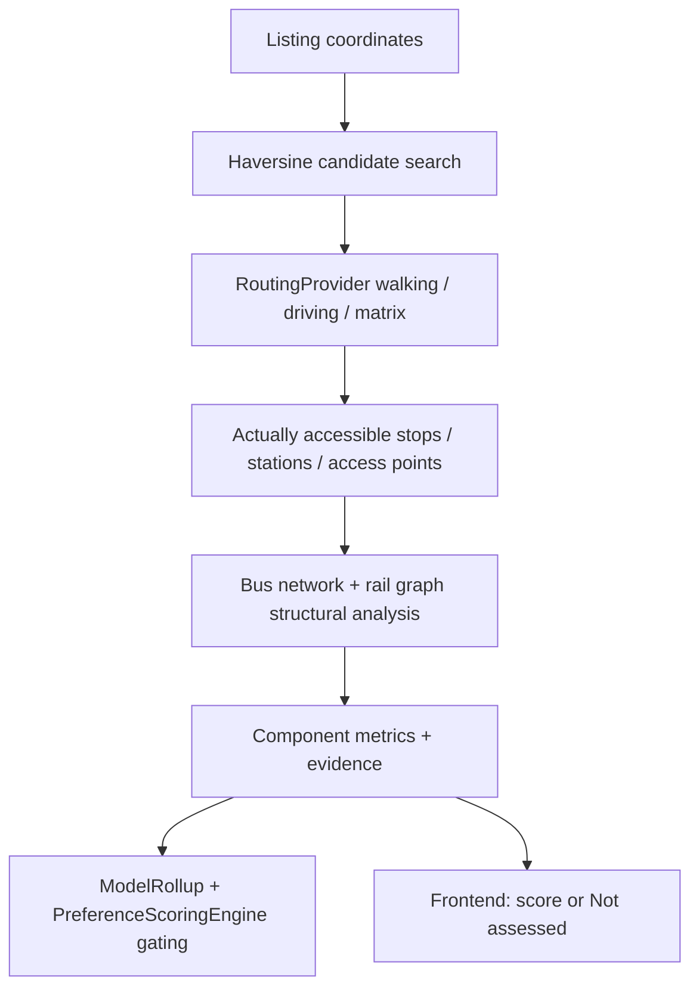

# NearHome Public Transport and Driving Models

Canonical documentation for the rebuilt Public Transport and Driving
connectivity models. This document describes the implementation that exists
in the repository as of the rebuild dated **2026-08-03**. It is not
aspirational: unfinished capabilities are marked explicitly.

---

## 1. Purpose and scope

### What the Public Transport model measures

General neighbourhood public-transport strength for a listing, as four
weighted components:

1. **Access** — how easily residents can reach useful nearby bus stops and
   MRT/LRT stations (routed walking).
2. **Bus coverage** — genuinely different bus corridors reachable directly
   or via one practical transfer (deduplicated, not raw stop/service counts).
3. **MRT reach and connections** — from the geographically closest MRT station,
   how much of the rail network becomes available (structural rail graph).
4. **Route resilience** — whether genuinely independent alternatives exist
   if the usual route is disrupted.

### What the Driving model measures

General neighbourhood driving connectivity, independent of a buyer's personal
destination, as four weighted components:

1. **Peak-hour major-road access** — routed peak driving time to a *useful*
   expressway/arterial entrance (not the geographically closest coordinate).
2. **Route connectivity** — genuinely independent driving alternatives,
   classified by road-name overlap.
3. **Peak-hour access reliability** — extra minutes vs off-peak to the *same*
   selected access point.
4. **Home parking convenience** — routed walk to up to five official HDB
   carpark candidates (500 m Haversine prefilter; routed walking final).

Driving Connectivity weights are 30% major-road access, 25% route flexibility,
25% peak-hour access reliability, and 20% home parking.

### General neighbourhood scores vs personal journeys

| Concern | Where it lives | What it answers |
| ------- | -------------- | --------------- |
| General PT / Driving strength | `engines/public_transport/*`, `engines/driving/*` | “How well connected is this neighbourhood?” |
| Personal important-location journeys | `enrichment_service._enrich_journeys` + `regular_destination_journeys` API field | “How long is *my* trip to work / parents / X?” |

A home can score highly on general PT strength and poorly for a specific
commute, or vice versa. Personal journeys remain a **separate** stored
concept (`JourneyEstimate` / `journey_results`). Expanding them to full
route-steps/transfers is **deferred** (see §12).

Journey estimates are persisted with a UTC retrieval timestamp while keeping
the requested local IANA timezone (for example, `Asia/Singapore`) as journey
metadata. This keeps storage timestamps unambiguous without allowing the
stored timezone string to interfere with persistence.

### Why the models are deterministic

Every formula, weight, threshold and overlap heuristic is explicit code
(configurable via `engines/transport_config.py`). There is no machine
learning, no scraped Google Maps pages, and no invented fallback scores
when data is missing.

---

## 2. Shared routing layer

### Interface

`apps/api/app/adapters/routing/base.py`

```python
class RoutingProvider(ABC):
    def get_walking_route(self, origin, destination) -> RouteResult: ...
    def get_driving_route(self, origin, destination, departure_time, traffic_aware=True) -> RouteResult: ...
    def get_driving_alternatives(self, origin, destination, departure_time) -> list[RouteResult]: ...
    def get_transit_route(self, origin, destination, departure_time) -> RouteResult: ...
    def get_route_matrix(self, origins, destinations, mode, departure_time=None) -> RouteMatrixResponse: ...
```

Common result shape (`RouteResult`):

- `duration_minutes`, `distance_metres`
- `transfers`, `walking_minutes` (transit)
- `route_steps: list[RouteStep]` (instruction, mode, distance, duration, optional transit line/service)
- `provider`, `departure_time`, `arrival_time`, `traffic_aware`
- `warnings`, `is_alternative`, `route_label`

Errors raise `RoutingProviderError` / `RoutingUnavailableError` — engines
must surface `provider_error` / `not_assessed`, never fabricate a route.

### Implemented providers

| Provider | File | When used |
| -------- | ---- | --------- |
| `GoogleRoutingProvider` | `adapters/routing/google.py` | Live mode when `GOOGLE_MAPS_API_KEY` is set and `DEMO_MODE` is false |
| `MockRoutingProvider` | `adapters/routing/mock.py` | Explicit demo mode or missing API key only; live Google failures remain provider errors |

Factory: `adapters/factory.py` → `get_routing_provider()`.

`GoogleRoutingProvider` uses:

- Routes API `computeRoutes` (walking / driving + alternatives / transit)
- Routes API `computeRouteMatrix` (bulk duration queries)

Provider-specific parsing stays inside the adapter. Engines only see
`RouteResult`.

### Caching

`adapters/routing/cache.py` — Redis cache-aside on the existing `redis_url`.

Key components: rounded coords (~4 decimal places), method, mode,
departure-time bucket (`AM_PEAK` / `PM_PEAK` / `OFF_PEAK` × weekday flag),
provider, optional extras (e.g. traffic-aware).

| Kind | TTL |
| ---- | --- |
| Walking / transit / non-traffic driving | 24 hours |
| Traffic-aware driving / alternatives | 15 minutes |

If Redis is unreachable the cache no-ops; scoring still works. Persisted
evidence is written to Postgres via the enrichment repository regardless of
cache TTL.

### Rate limits and failures

- HTTP 429 / 403 → `RoutingProviderError(retryable=True)`
- Other 4xx/5xx → `RoutingProviderError`
- Empty routes → `RoutingUnavailableError`
- Engines catch these and return `provider_error` / `not_assessed` with
  `score=None`
- The live adapters log a development diagnostic containing the endpoint,
  request method/body, field mask, API-key presence (never the key), response
  status, complete provider error body, and stack trace. The body is read as
  text once on the error path and is never parsed again afterward.
- In `APP_ENV=development`, `POST /api/v1/diagnostics/google-routes` probes
  the primary Google provider without the normal mock fallback and returns a
  structured diagnostic (`success`, `httpStatus`, `errorCode`, `message`, and
  `requestId`). The endpoint is hidden outside development.
- Driving requests omit `departureTime` when using `TRAFFIC_UNAWARE`; Google
  rejects that combination. Driving route-matrix requests set
  `routingPreference=TRAFFIC_AWARE` when a departure time is supplied.

### Haversine’s limited role

Haversine (`adapters/reference_data.haversine_m`) is used **only** to
shortlist candidates (bus stops, stations, road access points, carparks).
User-facing walk/drive minutes always come from `RoutingProvider`.



---

## 3. Public Transport data sources

| Source | Provider / dataset | Fields used | Ingestion | Fixture / location | Limitations | Provenance |
| ------ | ------------------ | ----------- | --------- | ------------------ | ----------- | ---------- |
| BusStops | LTA DataMall BusStops (pre-existing ingest) | stop_code, description, road, lat/lng | `data_pipeline/ingest_lta_reference.py` | `data_pipeline/fixtures/lta_bus_stops.json` | Services list on stops is no longer the join source | OFFICIAL / CALCULATED |
| BusRoutes | LTA DataMall BusRoutes | service_no, direction, stop_sequence, bus_stop_code, distance_km, first/last bus | `data_pipeline/ingest_bus_routes.py --live` | `lta_bus_routes.json` (~26,880 rows) | Snapshot, not real-time | OFFICIAL |
| BusServices | LTA DataMall BusServices | service_no, direction, origin/destination, category, AM/PM peak & off-peak freq | `data_pipeline/ingest_bus_services.py --live` | `lta_bus_services.json` (~806 rows) | Frequencies are scheduled ranges, not waits/reliability | OFFICIAL |
| Rail stations + edges | Curated structure + OneMap geocode | codes, lines, lat/lng, ride/transfer edges | `data_pipeline/build_rail_graph.py` | `fixtures/rail/rail_stations.json` (184 stations), `rail_edges.csv`, `rail_lines_structure.csv` | Topology is hand-compiled; edge minutes are approximate | CURATED_REFERENCE_DATA |
| Walking / transit routes | Google Routes | duration, distance, steps | Live via `GoogleRoutingProvider` | Redis cache only | Provider-dependent; requires API key | ROUTED_LIVE |

Join rule (runtime, in `adapters/transport_data/lta_bus.py`):

```text
BusStops.BusStopCode = BusRoutes.BusStopCode
```

Validation: `data_pipeline/build_bus_indexes.py` and
`data_pipeline/validate_transport_data.py`. If
`LtaBusDataStore.is_usable()` is false, frequency/coverage components return
`not_assessed`.

---

## 4. Public Transport data structures

### Stop → services

```python
services_by_stop: dict[str, set[tuple[str, int]]]
# e.g. "76101" -> {("18", 1), ("28", 1), ("29", 1)}
```

Direction is always part of the key. Service `117` direction 1 and
direction 2 are never merged.

### Service-direction → ordered stops

```python
route_stops_by_service_direction: dict[tuple[str, int], list[BusRouteStop]]
```

Sorted by `stop_sequence`.

### Frequency by period

Parsed into `FrequencyRange(minimum_minutes, maximum_minutes, midpoint_minutes, source_period)`
on each `BusServiceInfo.frequencies` for periods
`AM_PEAK`, `AM_OFFPEAK`, `PM_PEAK`, `PM_OFFPEAK`.

User-facing label via `FrequencyRange.as_label()`:

```text
approximately 8-12 min
```

Never: “a bus arrives every 10 minutes”.

### Rail graph

- **Nodes**: station codes (e.g. `NS17`, `CC15`) — one node per
  station-line code; physical interchanges have multiple codes.
- **Ride edges**: adjacent codes on the same line (`edge_type=ride`,
  ~2–2.5 estimated minutes).
- **Transfer edges**: between codes of the same physical interchange
  (`edge_type=transfer`, ~5–6 estimated minutes).

Loaded by `adapters/transport_data/rail_data.py` into `RailGraphData`;
queried by `networks/rail_graph.py` (Dijkstra).

### Accessible-stop / route evidence

Produced by `engines/public_transport/access.py` and stored on
`ComponentResult.evidence`, e.g.:

```python
{
    "access_point_type": "bus_stop",
    "bus_stop_code": "76101",
    "name": "...",
    "walk_minutes": 2.8,
    "walk_distance_metres": 210,
    "services": [{"service": "18", "direction": 1}, ...],
}
```

---

## 5. Public Transport model

> **User-facing scoring reference:** [public-transport-strength-scoring.md](./public-transport-strength-scoring.md) — detailed breakdown of the four components, score bands, rollup rules, and status outcomes.

The buyer-facing comparison uses a collapsed per-listing Public Transport card
with the rating, rounded score, practical headline, main trade-off and optional
“Best for” interpretation first. Access, Bus coverage, MRT reach and Route
resilience are expanded separately; technical evidence, weights and raw counts
are inside **How this was calculated**. Personal journeys are rendered in a
separate **Your journeys** section.

Orchestrator: `engines/public_transport/engine.py` →
`compute_public_transport_model(lat, lng, routing)`.

Weights (`PublicTransportConfig` in `engines/transport_config.py`):

| Component | Weight |
| --------- | ------ |
| access | 0.30 |
| bus_coverage | 0.25 |
| mrt_reach | 0.30 |
| route_resilience | 0.15 |

Minimum core weight coverage for recommendation: **0.6**.

### 5.1 Access

| Field | Detail |
| ----- | ------ |
| Measures | Ease of reaching useful nearby PT access points |
| Inputs | Listing lat/lng; BusStops; rail stations; walking routes |
| Sources | `ReferenceDataStore.bus_stops()`, `RailGraph.nearby_station_codes`, `RoutingProvider.get_walking_route` |
| Calculation | Haversine pre-filter → routed walk-to-bus, direct-rail and feeder-rail paths → scheduled waiting proxy → choose one lowest generalised-cost path |
| Score bands | Generalised cost ≤4 → 95; ≤7 → 88; ≤10 → 80; ≤15 → 68; ≤20 → 55; ≤30 → 38; else 20 |
| Weight | 0.30 |
| Missing data | No practical path after successful routing → calculated low; all required routing fails → `provider_error` |
| Evidence | Best path of each type, selected path, practical rail entries, rejected paths, walk/wait/ride/transfer breakdown and provenance |
| Files | `engines/public_transport/access.py` |
| Tests | `tests/test_public_transport_engine.py::TestAccessComponent` |

Opposite-direction bus stops remain separate (never merged by name).

### 5.2 Bus coverage

```text
bus_coverage_score =
    direct_coverage_score × 0.70
    + practical_one_transfer_score × 0.30
```

Corridor dedup (`networks/bus_network.py`): two service-directions are the
same corridor when

```text
shared_stops / min(len(stops_a), len(stops_b)) ≥ 0.70
```

Union-find groups overlapping service-directions. Score buckets saturate at
8 direct / 12 one-transfer corridors.

| Field | Detail |
| ----- | ------ |
| Weight | 0.25 |
| Missing data | Unusable data / no walkable stops / no usable direct corridors → `not_assessed` |
| Frequency role | Scheduled frequency is only a usability gate; it adds no score |
| Files | `engines/public_transport/bus_coverage.py`, `networks/bus_network.py` |
| Tests | `TestBusCoverageComponent` (many stops one corridor vs few stops many corridors) |

### 5.3 MRT reach and connections

Uses exactly the **geographically closest active MRT station** to the listing
coordinates, independently of Access's practical walking/feeder result.
Structural Dijkstra then counts each physical station once in mutually exclusive buckets:

- direct lines at the geographically closest station
- interchange flag
- lines reachable within one transfer
- stations reachable within 30 / 45 structural minutes
- zero-transfer ≤30 minutes
- one-transfer incremental ≤30 minutes
- multi-transfer incremental ≤30 minutes
- extended incremental 31–45 minutes

```text
score = zero_transfer_score × .35
      + one_transfer_score × .35
      + multi_transfer_score × .10
      + extended_score × .20
```

| Field | Detail |
| ----- | ------ |
| Weight | 0.30 |
| Missing data | Rail graph not loaded, or no active station has valid coordinates → `not_assessed` |
| Limitation | Access separately reports practical entry; rail minutes remain structural approximations |
| Files | `engines/public_transport/mrt_reach.py`, `networks/rail_graph.py` |
| Tests | `TestMrtReachComponent`, golden cases (Dhoby Ghaut vs Yishun) |

### 5.4 Route resilience

Uses Access alternatives plus `bus_coverage` and `mrt_reach` evidence without
reusing raw scores:

```text
possible units = second access mode
               + second physical station
               + alternative rail line
               + first independent bus corridor
               + second independent bus corridor
```

| Field | Detail |
| ----- | ------ |
| Weight | 0.15 |
| Missing data | No bus/rail evidence → `not_assessed`; no independent fallback → calculated low |
| Files | `engines/public_transport/route_resilience.py` |
| Tests | `TestRouteResilienceComponent` |

---

## 6. Personal Public Transport journeys

**Status: unchanged shape in this rebuild (deferred enhancement).**

Personal journeys (work, parents, other important locations) still use the
older duration-only `get_routes_adapter()` path in
`enrichment_service._enrich_journeys`. Stored fields remain:

- mode, requested day/time, resolved departure
- `duration_seconds`, difference from fastest, status, provider

They are **not** part of the general PT `ModelRollup` and do not appear as
PT components. Full route-steps / transfers / walking portions for personal
journeys are a follow-up feature.

---

## 7. Rail graph

| Topic | Implementation |
| ----- | -------------- |
| Data source | Hand-compiled structure (`build_rail_graph.py`), version `2026-08-02`; coordinates via OneMap |
| Nodes | Station codes (`NS17`, `CC15`, …) |
| Edge types | `ride` (in-line adjacency), `transfer` (interchange) |
| Transfer modelling | Explicit transfer edges with ~5–6 min cost |
| Algorithms | Hand-rolled Dijkstra (`heapq`) for shortest path and reachable-within |
| Reachable-within | Frontier expansion capped at configured minutes (30 / 45) |
| One-transfer lines | `lines_reachable_within_one_transfer(code)` |
| Alternative paths | Not a full k-shortest-path search in this pass; resilience uses structural line/corridor/station counts instead |
| Limitation | Graph minutes are approximate structural weights — **not** a live journey planner |

Small example (Bishan interchange):

```text
NS16 --ride--> NS17 --ride--> NS18
                 |
              transfer
                 |
CC14 --ride--> CC15 --ride--> CC16
```

---

## 8. Driving data sources

| Source | Detail | Provenance |
| ------ | ------ | ---------- |
| Google Routes (driving, traffic-aware, alternatives) | Peak/off-peak durations, steps for overlap | ROUTED_LIVE |
| Road access points | Curated 30 named arterial→expressway points, OneMap-geocoded; version `2026-08-02`; covers PIE, CTE, ECP, AYE, BKE, KJE, KPE, MCE, SLE, TPE | CURATED_REFERENCE_DATA |
| Peak / off-peak times | Configurable hours (default AM peak 08:00, off-peak 22:00 SGT) via `next_occurrence_at_hour` | — |
| HDB carparks | Official [HDB Carpark Information](https://data.gov.sg/datasets/d_23f946fa557947f93a8043bbef41dd09/view); SVY21→WGS84 via pyproj; static records plus live availability | OFFICIAL |
| Parking availability | Official [HDB Carpark Availability API](https://data.gov.sg/datasets/d_ca933a644e55d34fe21f28b8052fac63/view); cached, stale/not-covered/error states preserved | ROUTED_LIVE |

Ingestion:

- `data_pipeline/build_road_access_points.py` (OneMap)
- `data_pipeline/ingest_hdb_carparks.py`
- `data_pipeline/ingest_hdb_carparks.py --live --persist-db` also mirrors the
  refreshed static records into `hdb_carparks`.

---

## 9. Driving model

Orchestrator: `engines/driving/engine.py` →
`compute_driving_model(lat, lng, routing, destination_requests=...)`.
The compatibility `destination_requests` argument is ignored by the general
rollup; personal journeys are calculated by `_enrich_journeys` and returned in
the separate `regular_destination_journeys` API collection.

Weights (`DrivingConfig`):

| Component | Weight |
| --------- | ------ |
| major_road_access | 0.30 |
| route_connectivity | 0.25 |
| peak_access_penalty | 0.25 |
| parking_convenience | 0.20 |

Minimum core weight coverage: **0.6**.

### 9.1 Peak-hour major-road access

1. Haversine shortlist within 6000 m (up to 6 candidates).
2. Route each at AM peak with traffic-aware driving.
3. Select **shortest routed duration** (useful, not closest).
4. Score by minutes: ≤4 → 95; ≤7 → 85; ≤10 → 72; ≤15 → 58; ≤22 → 42; else 25.

Returns `MajorRoadAccessOutcome` so later components reuse the **same**
selected point/route.

| Missing data | Unusable dataset / no candidates → `not_assessed`; all routes fail → `provider_error` |
| Files | `engines/driving/major_road_access.py`, `adapters/transport_data/road_access.py` |
| Tests | `TestMajorRoadAccessComponent` (useful-not-closest, no 5-anchor reliance, provider error) |

### 9.2 Route connectivity

Uses distinct-expressway candidates from major-road access as destinations.
Requests driving alternatives; classifies each alt vs primary via
`networks/route_overlap.py`:

| Classification | Rule |
| -------------- | ---- |
| `not_practical` | duration penalty > 15 min |
| `independent` | overlap ratio ≤ 0.30 |
| `partially_independent` | ≤ 0.70 |
| `substantially_overlapping` | > 0.70 |

Overlap = Jaccard of named roads extracted from turn-by-turn instructions
(documented approximation; not polyline geometry). Fallback when no road
names parse: distance similarity (flagged in evidence note).

```text
score = min(95,
    50
  + 12 × min(3, distinct_expressways)
  + 6 × min(4, independent_alts)
  + 3 × min(4, partial_alts))
```

| Files | `engines/driving/route_connectivity.py`, `networks/route_overlap.py` |
| Tests | `TestRouteConnectivity`, `TestRouteOverlapClassification` |

### 9.3 Peak-hour access penalty

```text
peak_hour_access_penalty =
    peak_route_duration - off_peak_route_duration
```

Same origin, same selected access point, traffic-aware where available.
Higher component score = smaller penalty.

| Penalty (min) | Score |
| ------------- | ----- |
| ≤2 | 95 |
| ≤5 | 85 |
| ≤10 | 70 |
| ≤15 | 55 |
| ≤25 | 40 |
| else | 25 |

| Files | `engines/driving/peak_access_penalty.py` |
| Tests | `TestPeakAccessPenalty` |

### 9.4 Home parking convenience

Static records are refreshed from the official [HDB Carpark Information
dataset](https://data.gov.sg/datasets/d_23f946fa557947f93a8043bbef41dd09/view).
The ingestion job converts source SVY21 coordinates to WGS84 with `pyproj`,
retains source carpark type and missing values, and stores address,
parking-system, short/free/night-parking, decks, gantry-height, basement and
source-refresh metadata.

For each listing, the engine uses Haversine only to prefilter up to five
candidates within 500 m, then confirms each with Google walking routes. A
candidate above 12 minutes is not treated as practical. The primary carpark
is the shortest routed walk, with an explainable relevance signal combining
routed walking convenience, address-token/geographic proximity, carpark type,
and live capacity/coverage when available;
alternatives and counts within 250 m / 500 m are retained as evidence. This
is an evidence-based nearby match, not a claim of resident allocation. The
HDB outlines dataset is not joined because it has no reliable carpark-number
key in the current source.

The official [HDB Carpark Availability API](https://data.gov.sg/datasets/d_ca933a644e55d34fe21f28b8052fac63/view)
is cached for 60 seconds by default. It reports live, stale, not-covered and
temporarily-unavailable states; missing totals or availability remain null
and are never converted to zero. A single live reading is informational only.
The provider uses a 15-second request timeout and one bounded retry; failure
does not block the comparison and is surfaced as temporary unavailability.
Historical scoring requires at least five samples and exposes overall,
weekday-morning, weekday-evening and weekend medians where observations exist.
Historical snapshots are collected by the separate scheduled command
`data_pipeline/ingest_hdb_availability.py`, not as a blocking side effect of a
user opening a comparison.

Parking score (v2) uses configurable starting weights: walking 35%, type and
shelter 20%, capacity 15%, typical historical availability 20%, and access
restrictions 10%. Missing submetrics are excluded and the assessed weights
are renormalised; missing data is never treated as zero.

The comparison UI presents **Driving Connectivity** as a buyer-facing result.
It uses the shared Excellent (85–100), Good (70–84), Fair (55–69), Limited
(40–54) and Very limited (0–39) bands, with whole-number display scores and
the underlying score retained for ranking. A result is **Complete** only when
all four general driving components are assessed. If one or more of those
components are unavailable, the displayed weight-average is labelled
**Provisional**; available weights are renormalised for display and the
missing component and its configured weight are shown. A missing personal
destination does not affect coverage or status. If there is not enough
assessed coverage for a meaningful result, it is **Unavailable**.

The primary card explains each component in plain language: major-road access
is the route from the listing to a useful road entry, route flexibility is
meaningful road alternatives, peak-hour reliability compares the same road
entry at peak and off-peak, and parking convenience covers the likely nearby
HDB carpark and walk back to the block. A regular destination is not required
for this result.

### 9.5 Optional Regular Destination Journey

A buyer may add a complete important location for work, school, caregiving or
another regular trip. When its transport mode includes driving,
`_enrich_journeys` calculates a traffic-aware journey separately and the API
returns it under `regular_destination_journeys`. The result contains the
destination label/address, selected day and time, estimated duration, fastest
shortlist comparison, provider and confidence/limitation state where present.

It never contributes to the four-component Driving Connectivity numerator,
denominator, coverage ratio or recommendation-eligible score. With no driving
destination, the journey section is hidden and Driving Connectivity still
calculates normally. If routing fails after a destination is supplied, the
failure is shown locally in the journey section while general driving remains
valid.

Driving priority uses only `driving_access.overall_score`. The existing
`IMPORTANT_LOCATION_JOURNEY` priority uses the separate stored journey
duration. Selecting both represents two distinct preferences and does not
reuse the destination journey as a driving-connectivity component.

The API can also evaluate an explicit `MAX_DRIVING_JOURNEY_MINUTES` hard
requirement tied to an `important_location_id`. A routed duration within the
limit is `PASS`, an over-limit duration is `FAIL`, and a missing or failed
route is `CANNOT_DETERMINE`; it is never converted into a failed requirement.

Parking availability is displayed separately as an official HDB
data.gov.sg snapshot. It is converted to Singapore time and labelled Live
snapshot (≤5 minutes), Updated (≤15 minutes), Delayed (≤2 hours) or Stale
(>2 hours) using the record timestamp. Missing or malformed timestamps and
lot counts are shown as unavailable. Current available-lot counts do not
affect the parking-convenience score; only sufficiently sampled historical
availability can contribute to that score. Static carpark properties remain
from the official HDB Carpark Information dataset.

Technical routing assumptions, candidate counts, evidence, sources, weights,
limitations and carpark matching details are hidden under **View technical
assessment details** by default. The listing comparison is framed as general
driving connectivity; it does not claim that the general score represents the
buyer's full commute.

| Files | `engines/driving/parking_convenience.py`, `adapters/parking/hdb_carpark.py` |
| Tests | `TestParkingConvenience` |

---

## 10. Overall scoring

Shared rollup: `domain/transport_models.py` → `build_rollup`.

```text
display_score = weight-average of assessed component scores
coverage_ratio = assessed_weight / total_weight
counts_toward_recommendation = coverage_ratio ≥ min_core_weight_coverage (0.6)
overall_score = display_score if counts_toward_recommendation else None
is_complete = every component assessed
```

- Incomplete scores may still show `display_score` in the UI, labelled
  **Provisional** and not presented as a final commute comparison.
- `PreferenceScoringEngine` reads `overall_score` only; `None` is dropped
  per listing and cannot silently influence recommendations.
- Thresholds/weights live in `engines/transport_config.py`. They are
  **documented starting points**, not Singapore-wide percentile
  calibrations (future work).

---

## 11. Data quality and provenance

### Component statuses (`ComponentStatus`)

| Status | Meaning |
| ------ | ------- |
| `calculated` | Required data present; score computed |
| `estimated` | Reserved for weaker estimates (used when applicable) |
| `partially_assessed` | Reserved for partial component assessment |
| `not_assessed` | Required data absent — **score is None** |
| `provider_error` | Routing/provider failure — **score is None** |
| `insufficient_data` | Too little evidence — **score is None** |

Construction of `ComponentResult` forces `score=None` / `value=None` for
`not_assessed`, `provider_error`, and `insufficient_data`.

### Provenance values used here

| Value | Meaning |
| ----- | ------- |
| `ROUTED_LIVE` | Live Google Routes result |
| `CURATED_REFERENCE_DATA` | Hand-compiled but real structural data (rail / road access points) |
| `CALCULATED` | Derived from official/curated inputs without a live route call |
| `MOCK_DEMO_DATA` | Demo/mock path |
| `OFFICIAL` | Official source datasets (LTA / data.gov.sg) |

### Confidence

Per-component strings such as `high` / `medium` / `unavailable`, stored on
`ComponentResult` and shown in the UI.

### Demo vs live

`get_routing_provider()` returns `MockRoutingProvider` only when `DEMO_MODE` is
true or `GOOGLE_MAPS_API_KEY` is missing. In live mode it returns
`GoogleRoutingProvider` directly, so a Google 4xx/5xx or network failure is
surfaced as `provider_error` rather than replaced with mock route durations.
Provider name on results therefore reflects the actual adapter.

### Incomplete dataset detection

`LtaBusDataStore.quality_report()` / `is_usable()` checks stop/route/service
counts, join coverage (≥50% stops with routes), minimum service-directions
(≥100), unknown stop refs, duplicate sequences. Rail/road/carpark stores
have their own usability floors.

### UI exposure of uncertainty

`comparison-view.tsx` `ModelRollupPanel` / `ComponentCard` show:

- score **or** “Not assessed”
- status badge, explanation, strengths, limitations, evidence
- note when `counts_toward_recommendation` is false

---

## 12. Known limitations

Genuine current limitations (not aspirational):

1. LTA bus frequencies are **scheduled ranges**, not reliability or
   real-time waits.
2. Rail graph ride/transfer minutes are **approximate structural weights**,
   not live train times.
3. Scheduled frequency is a waiting-time proxy, not a real-time prediction.
4. Corridor dedup uses stop-sequence overlap, not geometry/polylines.
5. Driving route overlap uses **named roads in turn-by-turn text**, not
   shared polyline distance.
6. Road access points and rail topology are **curated** and need periodic
   manual revalidation against LTA / road maps.
7. **Parking availability** is a point-in-time official snapshot; it is not a
   prediction of typical parking difficulty and current lot counts do not
   affect the score.
8. Personal important-location journeys remain **duration-only** (not
   rebuilt with full steps/transfers in this pass).
9. Score thresholds are deterministic heuristics, **not** statistically
   calibrated percentiles.
10. Disruption probability / crowding is not predicted.
11. Route-provider results depend on requested departure-time buckets and
    Google’s traffic model.

---

## 13. Refresh and maintenance process

### Environment variables

| Variable | Used for |
| -------- | -------- |
| `LTA_ACCOUNT_KEY` | BusRoutes / BusServices (and BusStops) live ingest |
| `GOOGLE_MAPS_API_KEY` | Live `GoogleRoutingProvider` |
| `ONEMAP_EMAIL` / `ONEMAP_PASSWORD` | Station and road-access geocoding |
| `REDIS_URL` (or app `redis_url` setting) | Route cache |
| `DEMO_MODE` | Force mock routing when true |

### Commands (from repository root)

```bash
# Bus reference (live)
python data_pipeline/ingest_bus_routes.py --live
python data_pipeline/ingest_bus_services.py --live
# BusStops (existing script, if refreshing stops too)
python data_pipeline/ingest_lta_reference.py --live   # if supported in your checkout

# Build / validate indexes
python data_pipeline/build_bus_indexes.py
python data_pipeline/validate_transport_data.py

# Rail graph (live OneMap geocode)
python data_pipeline/build_rail_graph.py

# Driving reference
python data_pipeline/build_road_access_points.py
python data_pipeline/ingest_hdb_carparks.py
```

### Cache expiry

Walking/transit ~24 h; traffic-aware driving ~15 min. Evidence in Postgres
is independent of cache TTL.

### Tests before deploy

```bash
cd apps/api
ruff check app
python -m pytest app/tests -q
```

Required suites for this feature:

- `test_transport_data.py`
- `test_rail_graph.py`
- `test_routing_provider.py`
- `test_public_transport_engine.py`
- `test_driving_engine.py`

---

## 14. Worked examples

### 14.1 Public Transport (illustrative)

Listing near a walkable MRT interchange and several bus stops:

1. **Access** — Haversine finds 4 bus stops + 1 interchange within
   pre-filter; Google walking and scheduled frequency produce one selected
   lowest-friction entry path → ~88.
2. **Bus coverage** — 5 direct corridors, 4 new one-transfer →  
   `direct_bucket×0.7 + transfer_bucket×0.3` → ~80.
3. **MRT reach** — the primary station's mutually exclusive buckets, with
   direct lines/interchange shown as evidence → ~90.
4. **Route resilience** — independent access mode, alternative station/line
   and independent corridors → high.

If coverage ≥ 0.6, `overall_score` = weight-average of assessed scores and
counts toward recommendation.

### 14.2 Driving (illustrative)

1. **Major-road access** — 6 candidates routed at 08:00; farthest CTE
   entrance is 6 min vs nearer PIE slip at 18 min → select CTE (useful not
   closest) → score ~85.
2. **Route connectivity** — alternatives to 3 expressways; 1 independent +
   1 partial → score mid-70s.
3. **Peak penalty** — same CTE point off-peak 12 min, peak 20 min →
   penalty 8 → score ~70.
4. **Parking** — matched multi-storey carpark, 2 min walk → score ~97;
   availability still “Not assessed”.

### 14.3 Missing-data example

Bus fixtures empty / failed validation:

- scheduled-frequency usability gates fail, so affected bus corridors are excluded
- `bus_coverage` → `not_assessed`, score `None`
- Access / MRT may still calculate from walking + rail graph
- If assessed weight < 0.6 → `overall_score=None`, UI shows partial
  `display_score` with “does not influence recommendation”

### 14.4 Partial-assessment example

Only `major_road_access` calculated (weight 0.35), others
`not_assessed`/`provider_error`:

- `coverage_ratio = 0.35 < 0.6`
- `display_score` shown; `overall_score = None`
- `counts_toward_recommendation = False`

---

## 15. Specification-to-code traceability

| Specification requirement | Implementation file | Test file | Status |
| ------------------------- | ------------------- | --------- | ------ |
| No fake fallback scores / `not_assessed` | `domain/transport_models.py`, `domain/enums.py` | `test_public_transport_engine.py`, `test_driving_engine.py` | Done |
| Recommendation gating (min coverage) | `transport_models.build_rollup`, `preference_scoring.py` | `TestRecommendationGating`, `TestDrivingRecommendationGating` | Done |
| Geographic sanity (Woodlands ≠ Bishan) | `rail_graph.nearby_station_codes`, prefilter radii in config | `test_rail_graph.py::TestGeographicSanity`, access Woodlands test | Done |
| RoutingProvider abstraction | `adapters/routing/base.py` | `test_routing_provider.py` | Done |
| Google walking/driving/alts/transit/matrix | `adapters/routing/google.py` | (unit via mock; live integration manual) | Done |
| Mock provider + demo/live factory | `adapters/routing/mock.py`, `adapters/factory.py` | `test_routing_provider.py` | Done |
| Redis route cache | `adapters/routing/cache.py` | `TestCacheKey` | Done |
| BusRoutes/BusServices ingest + join | `ingest_bus_*.py`, `lta_bus.py` | `test_transport_data.py` | Done |
| Frequency ranges as ranges | `lta_bus.FrequencyRange` | `TestFrequencyParsing` | Done |
| Direction preserved | `LtaBusDataStore` keys | `test_direction_is_preserved_as_distinct_key` | Done |
| Corridor dedup 70% stop overlap | `networks/bus_network.py` | `TestBusCoverageComponent` | Done |
| Access via routed walk | `engines/public_transport/access.py` | `TestAccessComponent` | Done |
| Scheduled frequency as Access proxy | `access.py`, `lta_bus.py` | transport + Access regression tests | Done |
| Bus coverage 70/30 formula | `bus_coverage.py` | `TestBusCoverageComponent` | Done |
| MRT reach via rail graph | `mrt_reach.py`, `rail_graph.py` | `TestMrtReachComponent`, `test_rail_graph.py` | Done |
| Route resilience independent units | `route_resilience.py` | `TestRouteResilienceComponent` | Done |
| Curated rail graph + Dijkstra | `build_rail_graph.py`, `rail_graph.py` | `test_rail_graph.py` | Done |
| Major-road access useful-not-closest | `major_road_access.py`, `road_access_points.json` | `TestMajorRoadAccessComponent` | Done |
| Route overlap classification | `route_overlap.py`, `route_connectivity.py` | `TestRouteOverlapClassification`, `TestRouteConnectivity` | Done |
| Peak−off-peak same access point | `peak_access_penalty.py` | `TestPeakAccessPenalty` | Done |
| Parking convenience / availability N/A | `parking_convenience.py`, `hdb_carpark.py` | `TestParkingConvenience` | Done |
| Enrichment wiring | `enrichment_service.py` | suite + gating tests | Done |
| Frontend Not assessed + evidence | `comparison-view.tsx`, `api.ts` | (manual UI / type coverage) | Done |
| Personal journeys full steps/transfers | — | — | **Deferred** |
| Feeder-to-MRT access passed from Access | `access.py`, `mrt_reach.py` | revised PT tests | Done |
| Percentile score calibration | — | — | **Future** |

---

*End of canonical document. Location:*
`docs/transport-and-driving-models.md`
